# **Harjoitus 2**

Harjoitustyön tehtävänantona käytettiin Karvisen kotisivuilta löytyvää [h3-kohtaa](https://terokarvinen.com/2021/linux-palvelimet-ict4tn021-3018/#h3)

**Harjoituksen laitekokoonpano**  
*Järjestelmänä Win 11 + VirtualBox 6.0*  
  
*Koneen perustiedot:*  
*Suoritin: AMD Ryzen 9 5900HS 8-ytiminen 3,1 - 4,5 GHz, 16 Mt välimuisti*  
*Muisti: 16 Gt LPDDR4X*  
*Näytönohjain: NVIDIA GeForce RTX 3050 Ti 4 Gt GDDR6*  
*Kiintolevy: 512 Gt M.2 2230 NVMe PCIe 3.0 SSD*  

## a)Asenna Apache, laita käyttäjien kotisivut (http://example.com/~tero) toimimaan. Testaa esimerkkikotisivulla.

Aloitin tehtävän tekemisen kello 11:41.  

Ensimmäisenä etsin tietoa siitä miten saan poistettua Apache2-asennuksen, kun se oli edellisellä tunnilla asennettu tuntitehtävänä.  

Lähteenä käytin [Xmodulo-sivustoa](https://www.xmodulo.com/how-to-uninstall-and-remove-apache2-on-ubuntu-debian.html).  

Ensimmäisenä pysäytin daemonin komennolla:  
*sudo service apache2 stop*  

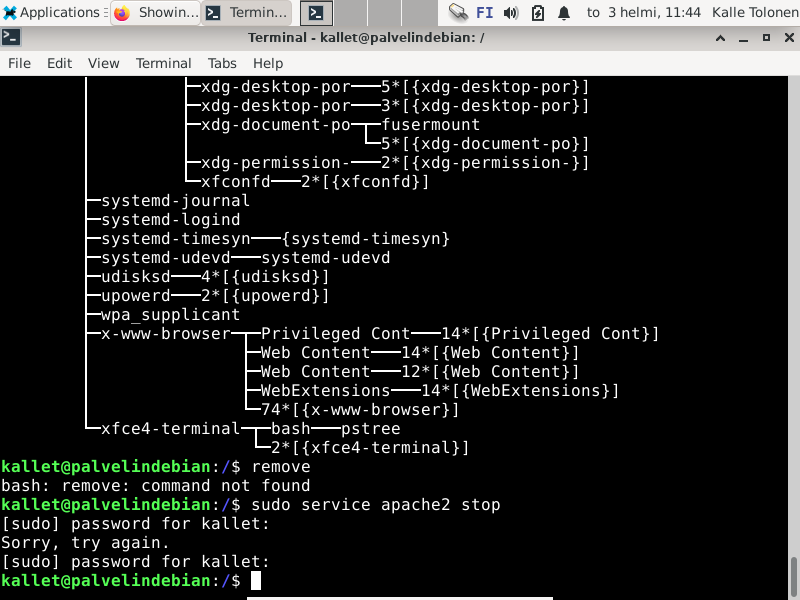  
*daemonin pysäyttäminen*  

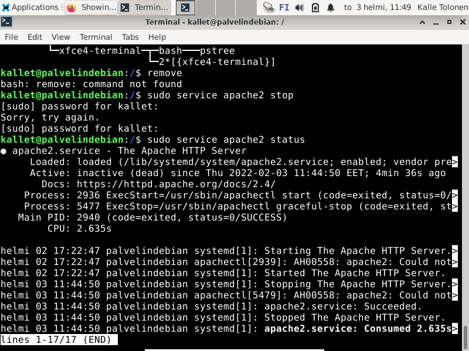  
*Tarkistin vielä, että daemoni oli sammunut. Tein sen komennolla: sudo service apache2 status*  
  
Seuraavana vaiheena oli poistaa Apache2 ja sen pakettiriippuvuudet komennoilla:  
*sudo apt-get purge apache2 apache2-utils apache2.2-bin apache2-common*  
*sudo apt-get autoremove*  
  
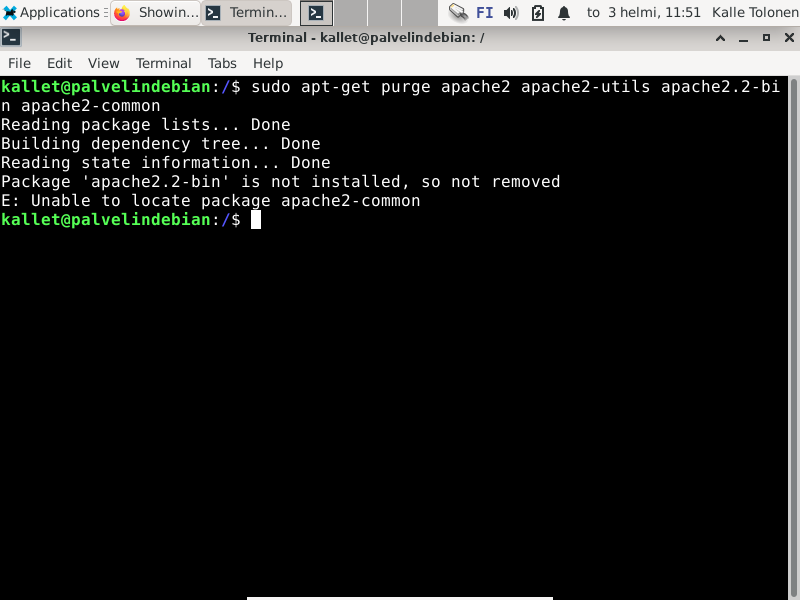  
*purge-komennon lopputulos. Ohjeesta poiketen apache2.2-bin- ja apache2-common -paketteja ei ollut koneellani asennettuna, joten niitä ei myöskään pystytty poistamaan*  

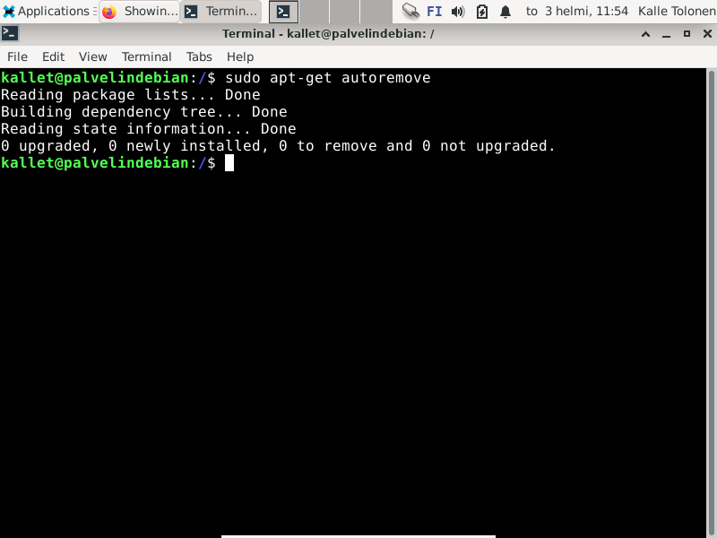  
*autoremove-komennon lopputulos - mitään ei tehty?*  
  
Tiedonhaun tuloksena päättelin, että autoremove poistaa sellaisia paketteja, joita asennettiin ja jotka olivat pelkästään asennetun ohjelman, l. Apache2-daemonin, käytössä, mutta joita eivät enää muut ohjelmat tarvitse. Tästä syystä mitään ei siis tehty käskyn tuloksena.  
  	  
Lähde: https://www.networkworld.com/article/3453032/cleaning-up-with-apt-get.html  
  
Whereis-komennolla selvisi, että Apache2 jäi edelleen kummittelemaan moneen paikkaan, joten päätin poistaa kaikki loputkin tiedostot.  

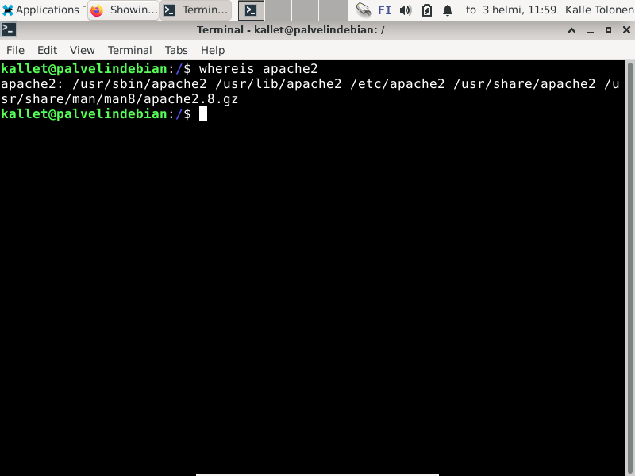  
*whereis-komennon lopputulos - paljon tavaraa oli edelleen jäljellä*  

Poistin loput tiedostot ja kansiot komennolla:
*sudo rm -r  hakemistot ja tiedostot*  

Yritin säästää kirjoittamista ja tehdä pipe-komennon, mutta en siinä onnistunut. Käyttämäni logiikka oli:  
*rm -r | whereis apache2*  
  
  
*Viimeisten tiedostojen poistaminen onnistui parin käyttäjävirheen jälkeen.*  
  
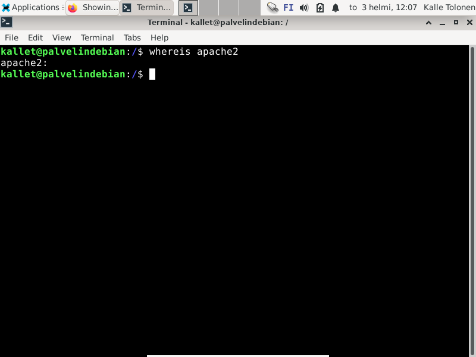  
*Tarkistin lopputuloksen ajamalla whereis-komennon uudestaan.*  
  
Lopuksi tarkistin löytyikö koneelta enää Apache2-asennukseen liittyviä tiedostoja:
*whereis apache2*  

  
### Apache2-asennus
  
Edellisen asennuksen poistamisen jälkeen oli vuorossa apache2-paketin asentaminen uudelleen. Aloitin urakan komennoilla:  
*sudo apt-get update*  
*sudo apt-get install -y apache2*  

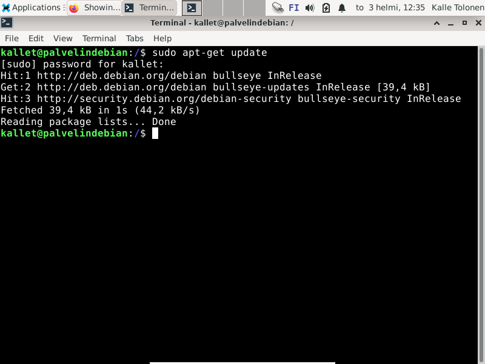  
*updaten tulos*  
  
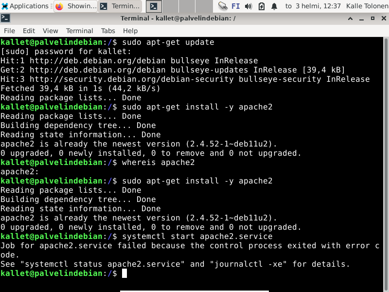  
*Apache2 oli apt-getin mukaan asennettu, vaikka olin sen poistanut jo aiemmin. Kokeilin vielä käynnistää Apache2-daemonin komennolla: systemctl start apache2.*  

Ensimmäisenä toimenpiteenä päätin käynnistää järjestelmän uudestaan komennolla:
*sudo reboot*  

Uudelleenkäynnistäminen ei korjannut ongelmaa, joten etsin lisää tietoa hakulauseella "how to reinstall apache2". Ohjeet löytyivät näppärästi, ja päätin kokeilla [niitä](https://askubuntu.com/questions/111770/how-reinstall-apache2). Aloitin syöttämällä komennon:  
*sudo apt-get -purge remove apache2*  

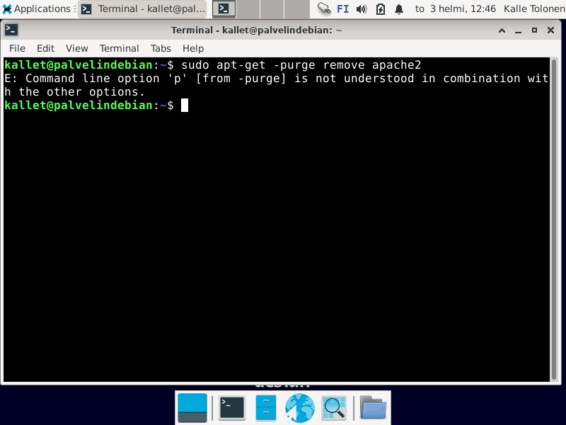  
*Epäonnistunut poistoyritys*  
  
Tein siis samat toimenpiteet kuin ylempänä, mutta nyt parametri apt-getille syötettiin väliviivan kanssa. Sain tulokseksi virheilmoituksen, joka kertoi että -purge ei ole Debianissa kelvollinen parametri. Palasin etsimään lisäohjeita tarkennetulla hakulauseella ja löysin [ohjeet](https://unix.stackexchange.com/questions/367338/re-install-apache2-after-purge-apt-get-says-its-already-the-newest-version).  

*Toimin seuraavasti:*  
sudo apt-get remove --purge apache2*  
sudo apt-get --reinstall install apache2  
  
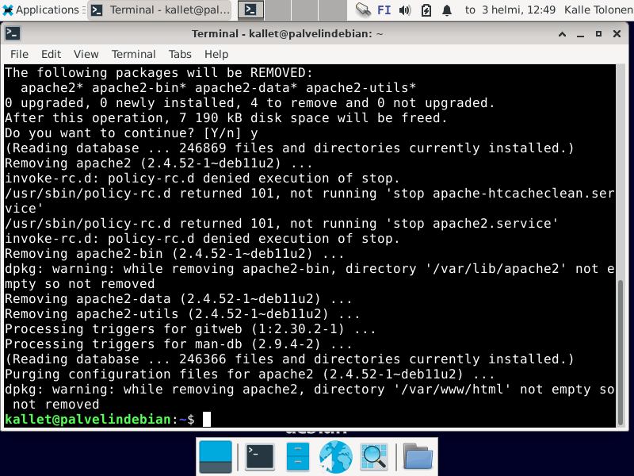  
*Onnistunut poisto*  
  
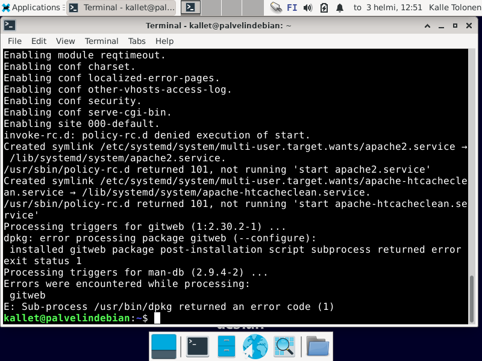  
*Onnistunut asennus*  
  
Näillä komennoilla sain asennuksen tehtyä, joten pystyin siirtymään projektissani eteenpäin. Uskon että virheeni oli väliviivojen määrässä tai parametrien syöttöjärjestyksessä.  

### Apache2-daemonin käynnistäminen ja testaaminen

Käynnistämiseen ja käynnistymisen tarkastamiseen käytin komentoja:  
*systemctl start apache2.service* (ajoin tämän vahingossa ilman sudoa, jolloin päädyin täyttämään käyttöoikeuden antaneen salasanan popup-ikkunaan)  
*sudo service apache2 status*  
  
  
*Daemoni saatiin käynnistettyä*  

Tämän lisäksi päätin varmistua daemonin käynnistymisestä tarkastamalla localhostin tilanteen selaimesta ja terminaalista. Kirjoitin selaimen osoitepalkkiin osoitteeksi "localhost", jolloin huomasin, että tuntiharjoitus kummitteli edelleen serverin tarjoamassa sivussa.

  
*Tuntiharjoituksen jäämistöä*  

Etsin käsiini ohjeet localhostin sijainnista [koneella](https://www.linuxquestions.org/questions/linux-server-73/localhost-folder-717841/) ja muokkasin siellä olevaa index.html-tiedostoa.  
  
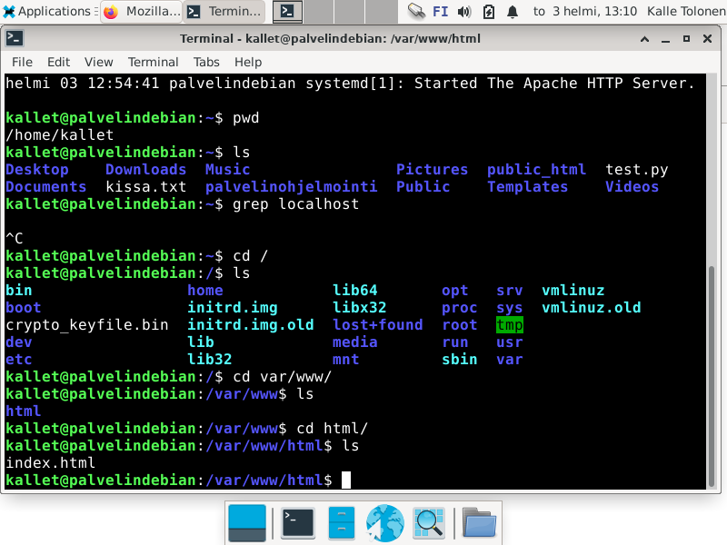  
*localhostin sijainti koneella on /var/www/html/*  

Muokkasin tiedoston sisältöä microlla:  
*micro index.html*  
  
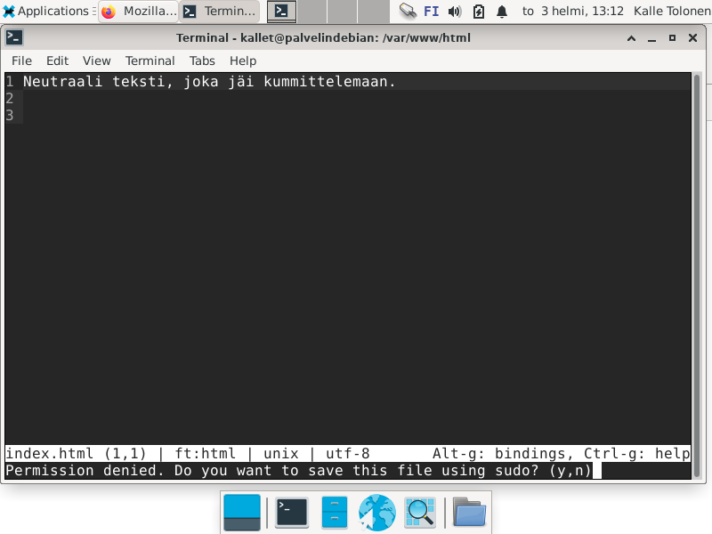  
*Myös microlla editointi tarvitsi sudo-oikeudet. Micro osasi kysyä niitä ja täytin ne terminaalissa ennen tallentamista.*  
  
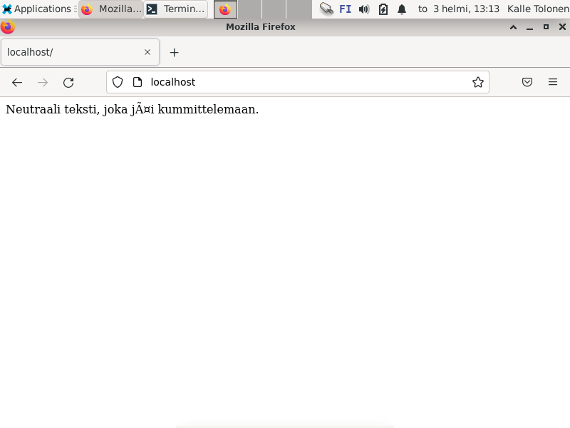  
*Päivitetty localhostin sivu*  

## Uuden käyttäjän tekeminen

Tein uuden käyttäjän komennolla:  
*sudo adduser kallet01*  

Syötin kaikki tarpeelliset tiedot ja tuloksena oli uusi käyttäjä.  
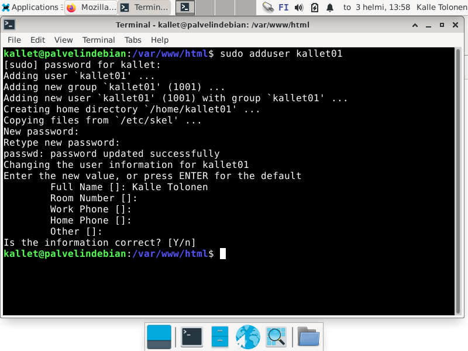  
*Uuden käyttäjän luominen sujui hyvin*  

Siirryin kallet01-käyttäjän kotihakemistoon /home/kallet01 ja loin sinne kansion "public_html" komennolla:  
*sudo mkdir public_html*  
  
Pääkäyttäjän oikeuksia tarvittiin luomiseen, sillä olin kirjautunut sisään toisella käyttäjätunnuksella.  

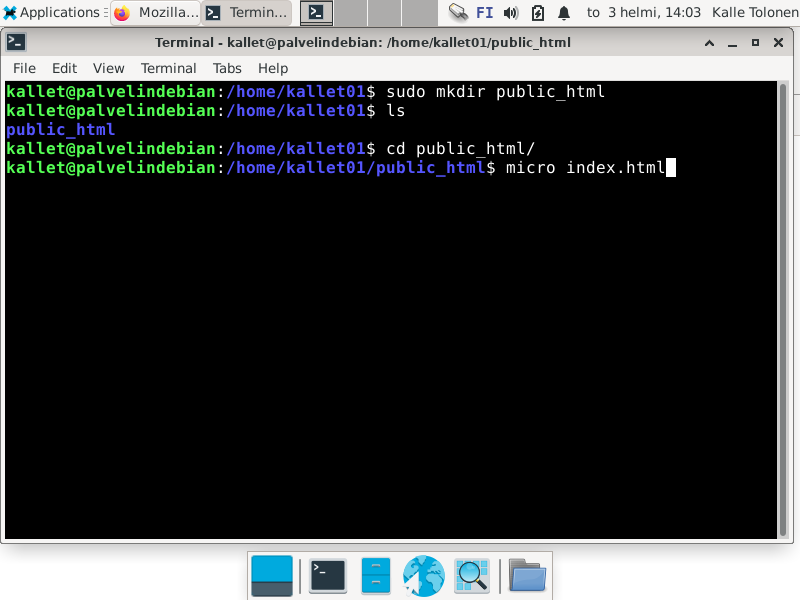  
*Tässä luotiin uusi index.html-tiedosto micro-editorilla*  
  
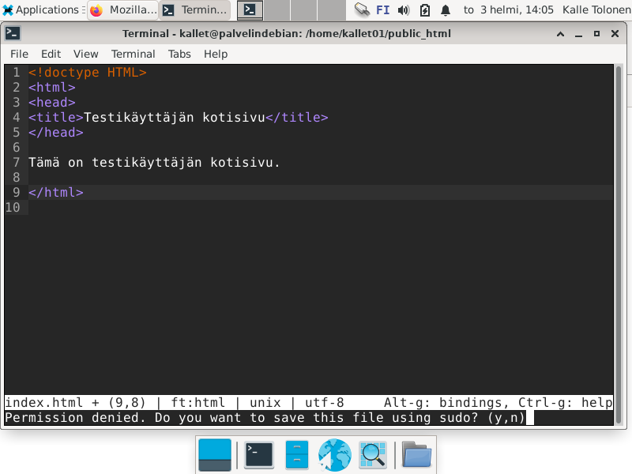  
*Unohdin jälleen käyttää sudoa micron ajamiseen, mutta onneksi se osasi pyytää valtuuksia myös jälkikäteen*  
  
Iteroin index.html-tiedoston läpi cat-komennolla:  
*cat index.html*  

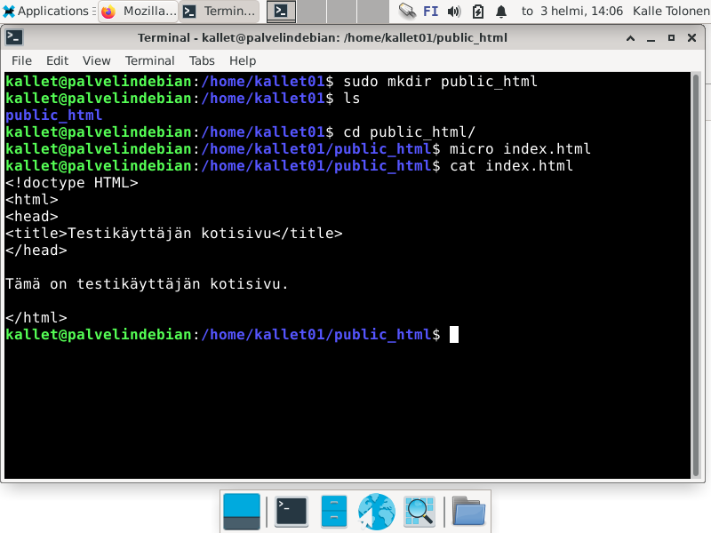  

Lopuksi tarkistin selaimesta, että käyttäjällä kallet01 on todella localhostilla pyörivä kotisivu. Sitä ennen tuli vielä ajaa komennot:  
*sudo systemctl a2enmod userdir*  
*sudo systemctl restart apache2*  
  
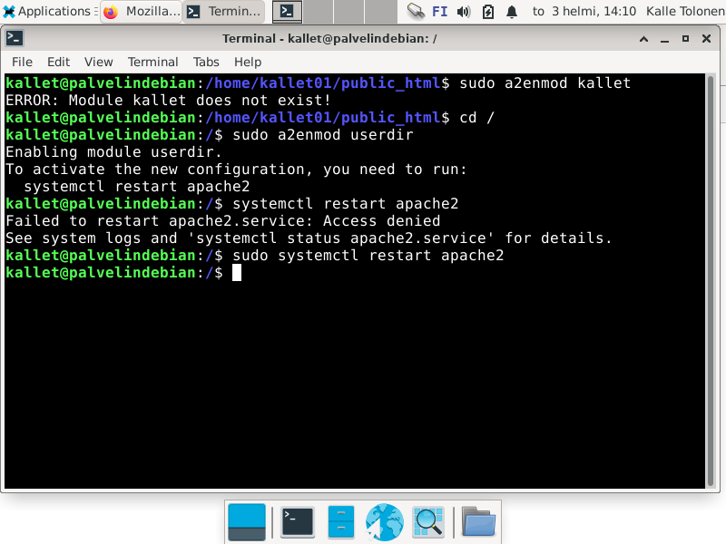  
*Luulen että ensimmäinen komento määrittää käyttäjähakemistot aktiivisiksi apache2-daemonille. Tiedän että jälkimmäinen käynnistää daemonin uudestaan.*  

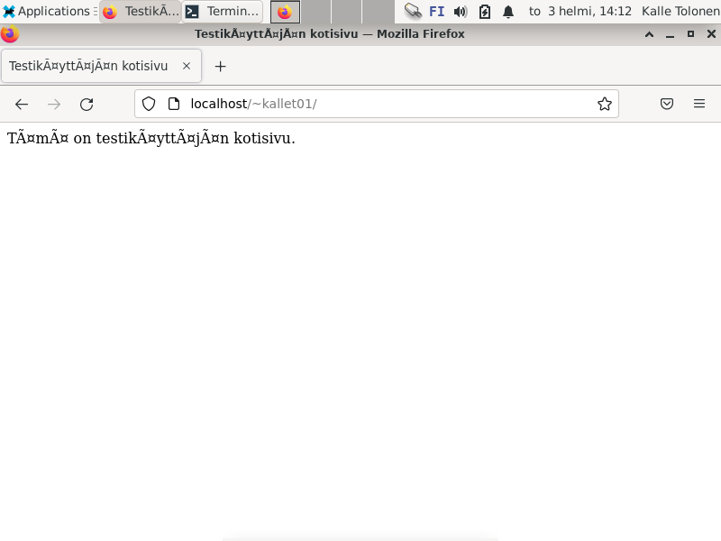  
*Kotisivut olivat localhostilla pyörimässä onnistuneesti*  
  
Lopetin tehtävien täyttämisen tältä erää ja kello oli 14.15.  

## b) Surffaa oman palvelimesi weppisivuja. Etsi Apachen lokista esimerkki onnistuneesta (200 ok) sivulatauksesta ja epäonnistuneesta (esim 404 not found) sivulatauksesta. Analysoi rivit.
  
Aloitin työt uudelleen n. 14.50.  
  
Yritin siirtyä olettamaani apache2-lokikansioon hakemistossa:  
*/var/log/apache2*  
  
Kohtasin kuitenkin "access is denied"-ilmoituksen, joten yritin ajaa cd-komentoa sudolla.  

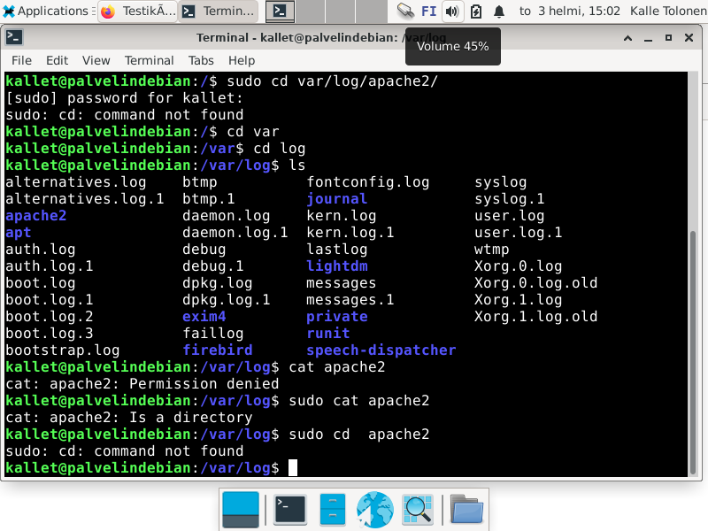  
*Sudo ei tunnistanut cd-komentoa*  
  
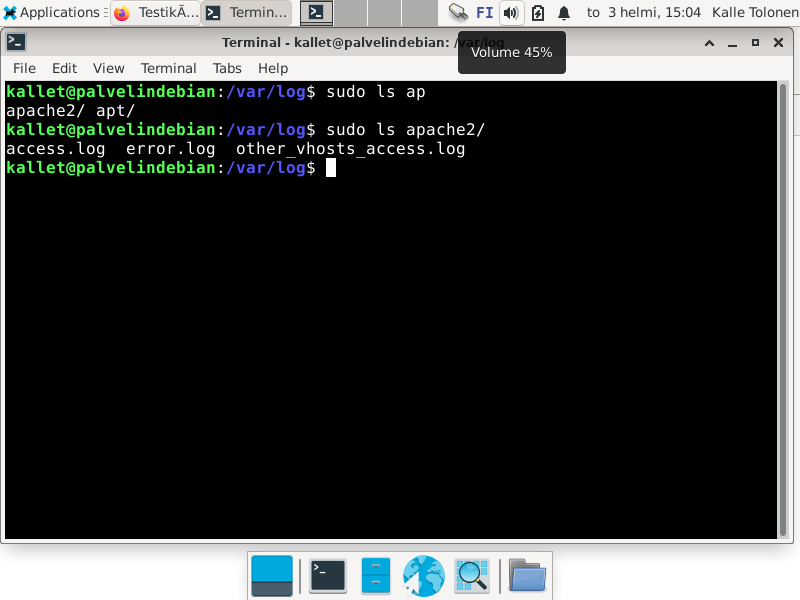  
*sudo ls-komento pystyy kuitenkin listaamaan hakemiston sisällön*  
  
Lokit saatiin avattua ja sieltä etsittyä epäonnistunut sivulataus.  
  
  
*Korostettuna epäonnistunut sivulataus*  

**Analyysi:  **
1. IP-osoite (localhost tässä tapauksessa)  
2. Aikaleima  
3. Backendille lähetetty kutsu, tässä tapauksessa GET
4. Osoite jota GET-käskyllä kutsuttiin ja protokolla
5. Virheilmoitusten tunnisteet: [404](https://en.wikipedia.org/wiki/HTTP_404) (sivua ei löydy) ja [488](https://knowledgebase-iframe.polycom.com/kb/viewContent.do;jsessionid=172A396E013F34FA5174D2BA3ABEE42B?externalId=45626) (pyyntöä ei hyväksytty)
6. Selaimen ja käyttöjärjestelmän versiot, selaimen ytimen version
  
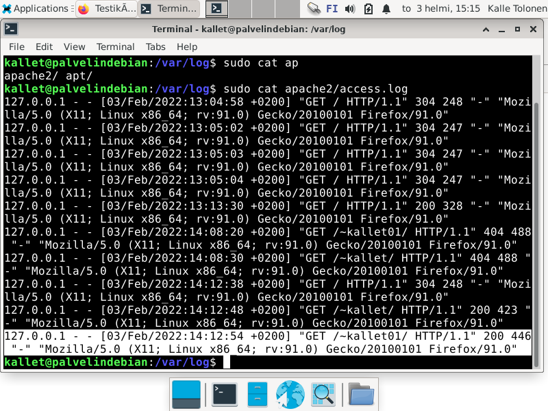  
*Korostettuna onnistunut sivulataus*  
  
**Analyysi:  **
1. IP-osoite (localhost tässä tapauksessa)  
2. Aikaleima  
3. Backendille lähetetty kutsu, tässä tapauksessa GET
4. Osoite jota GET-käskyllä kutsuttiin ja protokolla
5. Ilmoitusten tunnisteet [200](https://developer.mozilla.org/en-US/docs/Web/HTTP/Status/200) (sivulataus ok) ja 446, jonka merkitys ei auennut hakukoneenkaan kautta
6. Selaimen ja käyttöjärjestelmän versiot, selaimen ytimen version
  
Latasin git-palvelimelle työn viimeisimmän vaiheen 15.27.  
  
## c) Tee virhe weppipalvelimella ajettavaan koodiin (esim PHP tai Python), etsi se lokista ja analysoi tuo lokirivi

## f) Tee palvelimella ajettava weppiohjelma, joka tekee käyttäjälle jonkin yksinkertaisen laskun (esim. painoindeksi BMI)
  

*Tekijä: Kalle Tolonen*

