# **Harjoitus 3**

Harjoitustyön tehtävänantona käytettiin Karvisen kotisivuilta löytyvää [h3-kohtaa](https://terokarvinen.com/2021/linux-palvelimet-ict4tn021-3018/#h3)

**Harjoituksen laitekokoonpano**  
*Järjestelmänä Win 11 + VirtualBox 6.0*  
  
*Koneen perustiedot:*  
*Suoritin: AMD Ryzen 9 5900HS 8-ytiminen 3,1 - 4,5 GHz, 16 Mt välimuisti*  
*Muisti: 16 Gt LPDDR4X*  
*Näytönohjain: NVIDIA GeForce RTX 3050 Ti 4 Gt GDDR6*  
*Kiintolevy: 512 Gt M.2 2230 NVMe PCIe 3.0 SSD*  

## a) Asenna Apache ja osoita testillä, että se toimii.

Aloitin tehtävän tekemisen kello 11:41.  

Ensimmäisenä etsin tietoa siitä miten saan poistettua Apache2-asennuksen, kun se oli edellisellä tunnilla asennettu tuntitehtävänä.  

Lähteenä käytin [Xmodulo-sivustoa](https://www.xmodulo.com/how-to-uninstall-and-remove-apache2-on-ubuntu-debian.html).  

Ensimmäisenä pysäytin daemonin komennolla:  
*sudo service apache2 stop*  

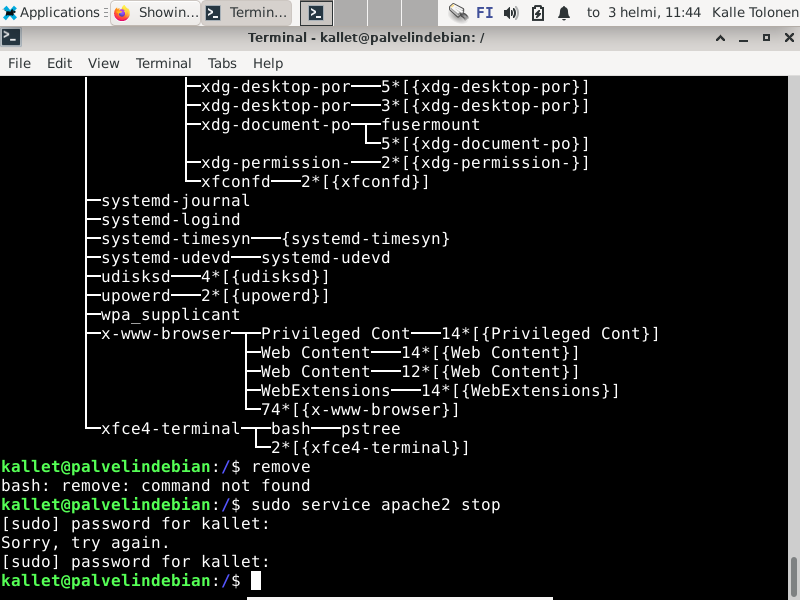  
*daemonin pysäyttäminen*  

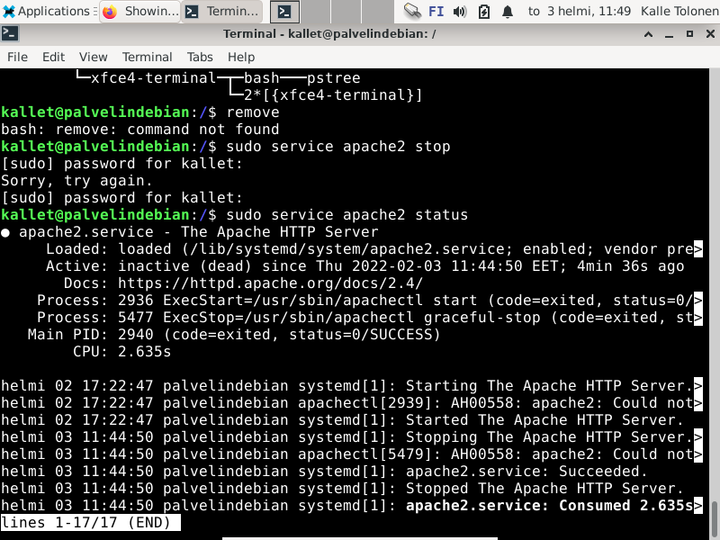  
*Tarkistin vielä, että daemoni oli sammunut. Tein sen komennolla: sudo service apache2 status*  
  
Seuraavana vaiheena oli poistaa Apache2 ja sen pakettiriippuvuudet komennoilla:  
*sudo apt-get purge apache2 apache2-utils apache2.2-bin apache2-common*  
*sudo apt-get autoremove*  
  
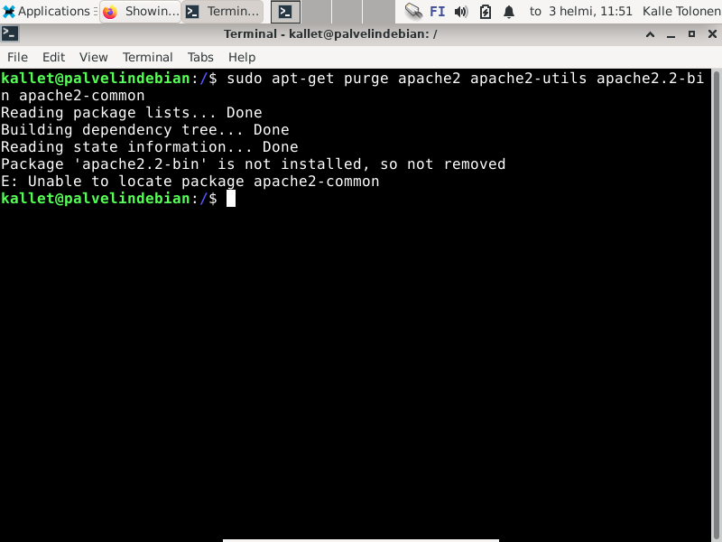  
*purge-komennon lopputulos. Ohjeesta poiketen apache2.2-bin- ja apache2-common -paketteja ei ollut koneellani asennettuna, joten niitä ei myöskään pystytty poistamaan*  

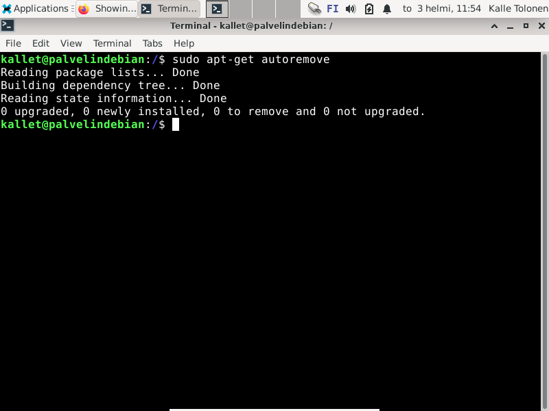  
*autoremove-komennon lopputulos - mitään ei tehty?*  
  
Tiedonhaun tuloksena päättelin, että autoremove poistaa sellaisia paketteja, joita asennettiin ja jotka olivat pelkästään asennetun ohjelman, l. Apache2-daemonin, käytössä, mutta joita eivät enää muut ohjelmat tarvitse. Tästä syystä mitään ei siis tehty käskyn tuloksena.  
  	  
Lähde: https://www.networkworld.com/article/3453032/cleaning-up-with-apt-get.html  
  
Whereis-komennolla selvisi, että Apache2 jäi edelleen kummittelemaan moneen paikkaan, joten päätin poistaa kaikki loputkin tiedostot.  

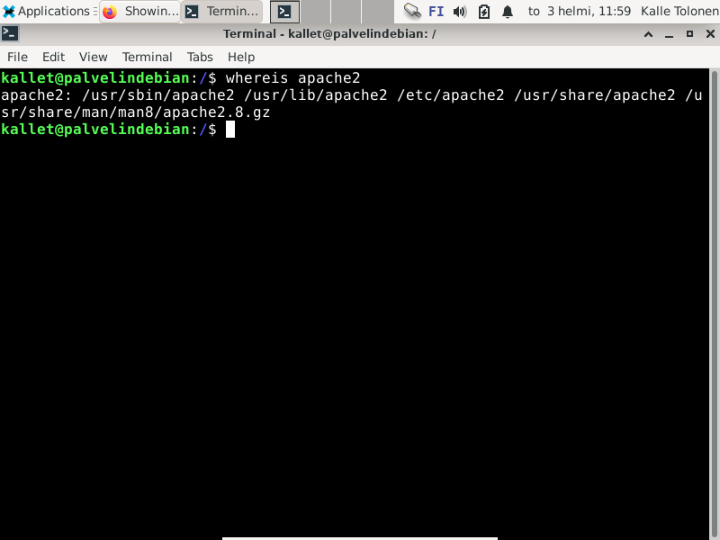  
*whereis-komennon lopputulos - paljon tavaraa oli edelleen jäljellä*  

Poistin loput tiedostot ja kansiot komennolla:
*sudo rm -r  hakemistot ja tiedostot*  

Yritin säästää kirjoittamista ja tehdä pipe-komennon, mutta en siinä onnistunut. Käyttämäni logiikka oli:  
*rm -r | whereis apache2*  
  
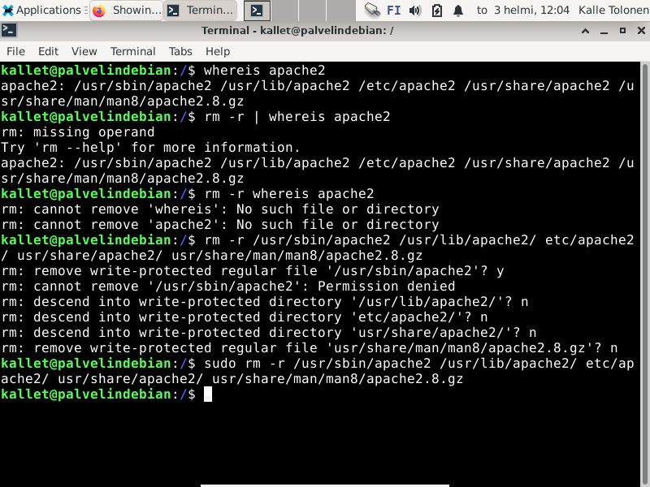  
*Viimeisten tiedostojen poistaminen onnistui parin käyttäjävirheen jälkeen.*  
  
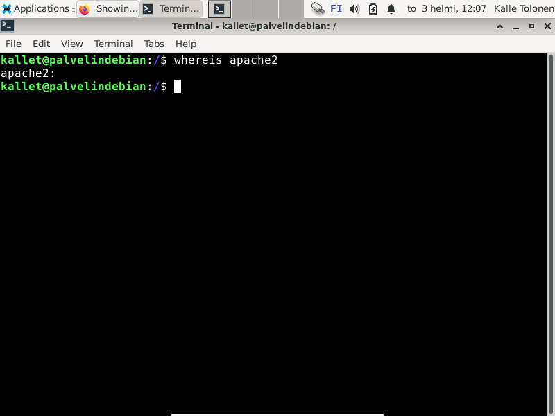  
*Tarkistin lopputuloksen ajamalla whereis-komennon uudestaan.*  
  
### Apache2-asennus
  
Edellisen asennuksen poistamisen jälkeen oli vuorossa apache2-paketin asentaminen uudelleen. Aloitin urakan komennoilla:  
*sudo apt-get update*  
*sudo apt-get install -y apache2*  

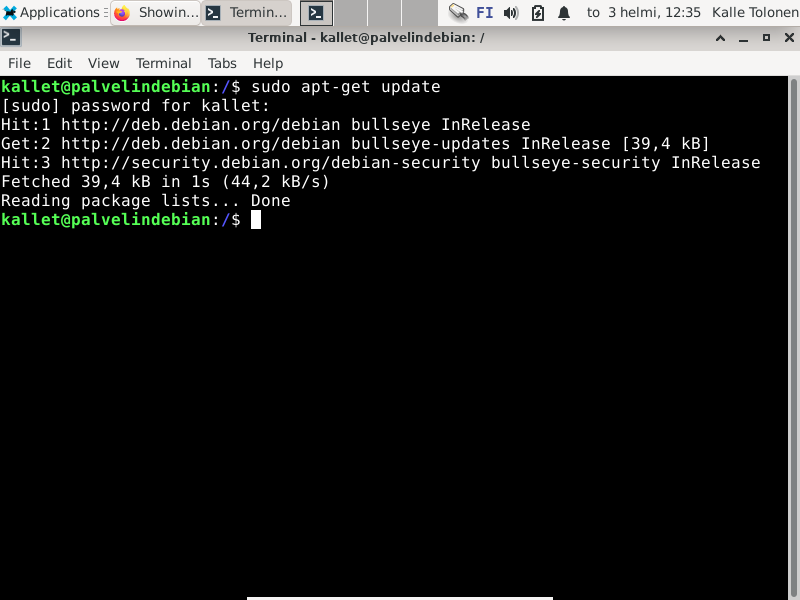  
*updaten tulos*  
  
  
*Apache2 oli apt-getin mukaan asennettu, vaikka olin sen poistanut jo aiemmin. Kokeilin vielä käynnistää Apache2-daemonin komennolla: systemctl start apache2.*  

Ensimmäisenä toimenpiteenä päätin käynnistää järjestelmän uudestaan komennolla:
*sudo reboot*  

Uudelleenkäynnistäminen ei korjannut ongelmaa, joten etsin lisää tietoa hakulauseella "how to reinstall apache2". Ohjeet löytyivät näppärästi, ja päätin kokeilla [niitä](https://askubuntu.com/questions/111770/how-reinstall-apache2). Aloitin syöttämällä komennon:  
*sudo apt-get -purge remove apache2*  

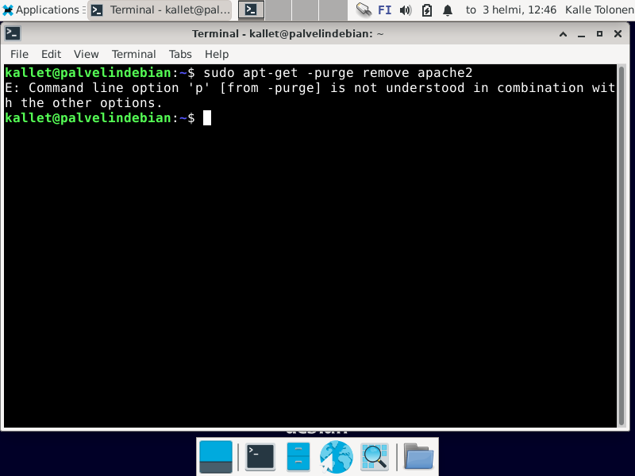  
*Epäonnistunut poistoyritys*  
  
Tein siis samat toimenpiteet kuin ylempänä, mutta nyt parametri apt-getille syötettiin väliviivan kanssa. Sain tulokseksi virheilmoituksen, joka kertoi että -purge ei ole Debianissa kelvollinen parametri. Palasin etsimään lisäohjeita tarkennetulla hakulauseella ja löysin [ohjeet](https://unix.stackexchange.com/questions/367338/re-install-apache2-after-purge-apt-get-says-its-already-the-newest-version).  

*Toimin seuraavasti:*  
sudo apt-get remove --purge apache2*  
sudo apt-get --reinstall install apache2  
  
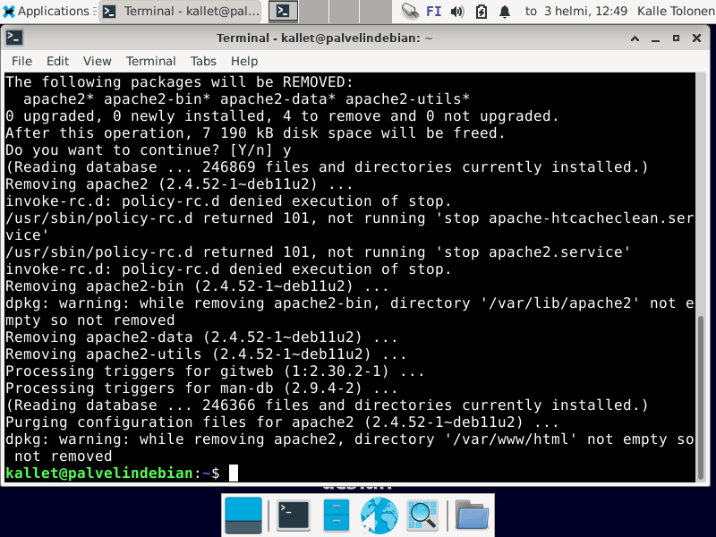  
*Onnistunut poisto*  
  
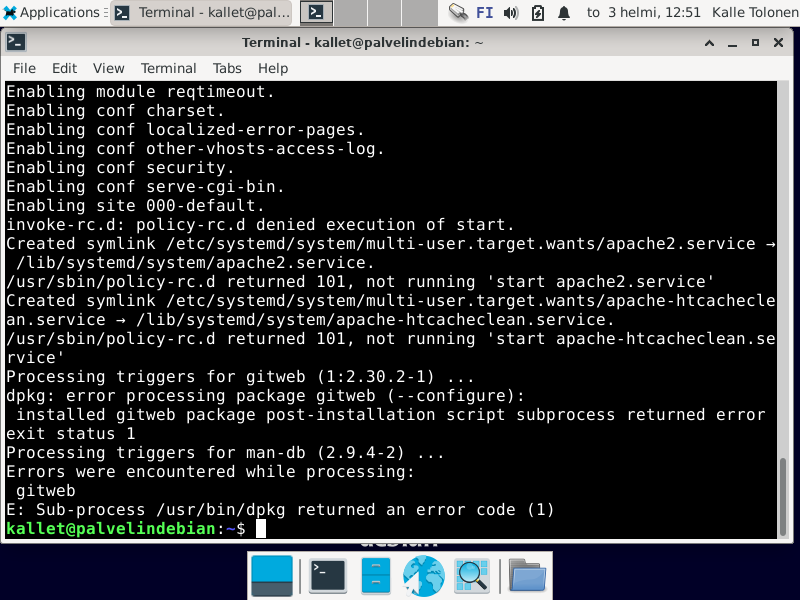  
*Onnistunut asennus*  
  
Näillä komennoilla sain asennuksen tehtyä, joten pystyin siirtymään projektissani eteenpäin. Uskon että virheeni oli väliviivojen määrässä tai parametrien syöttöjärjestyksessä.  

### Apache2-daemonin käynnistäminen ja testaaminen

Käynnistämiseen ja käynnistymisen tarkastamiseen käytin komentoja:  
*systemctl start apache2.service*  
(ajoin tämän vahingossa ilman sudoa, jolloin päädyin täyttämään käyttöoikeuden antaneen salasanan popup-ikkunaan)  
*sudo service apache2 status*  
  
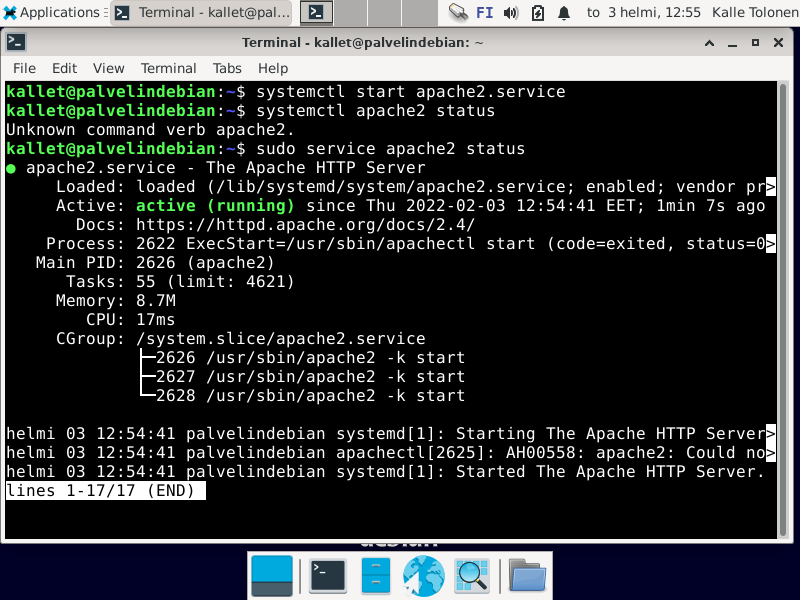  
*Daemoni saatiin käynnistettyä*  

Tämän lisäksi päätin varmistua daemonin käynnistymisestä tarkastamalla localhostin tilanteen selaimesta. Kirjoitin selaimen osoitepalkkiin osoitteeksi "localhost", jolloin huomasin, että tuntiharjoitus kummitteli edelleen serverin tarjoamassa sivussa.

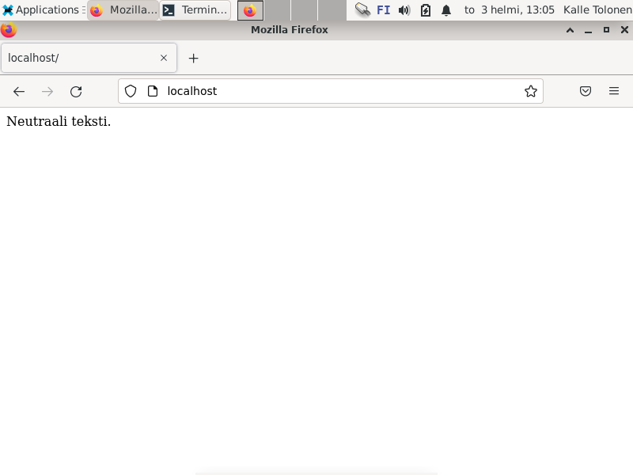  
*Tuntiharjoituksen jäämistöä*  

Etsin käsiini ohjeet localhostin sijainnista [koneella](https://www.linuxquestions.org/questions/linux-server-73/localhost-folder-717841/) ja muokkasin siellä olevaa index.html-tiedostoa.  
  
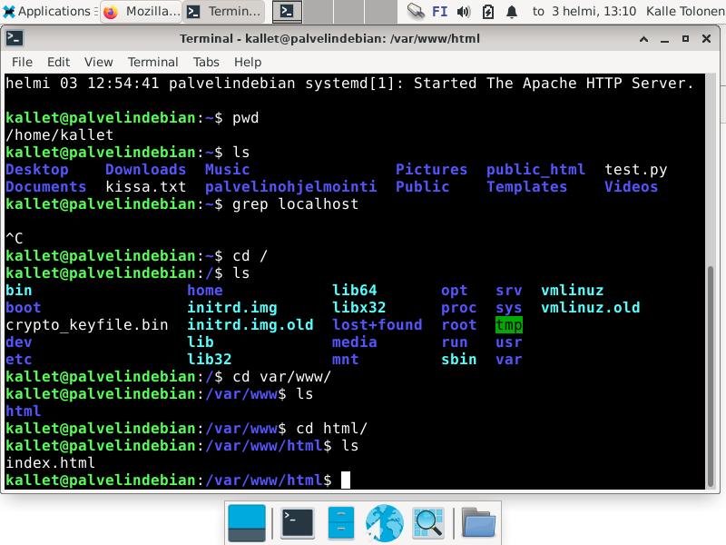  
*localhostin sijainti koneella on /var/www/html/*  

Muokkasin tiedoston sisältöä microlla:  
*micro index.html*  
  
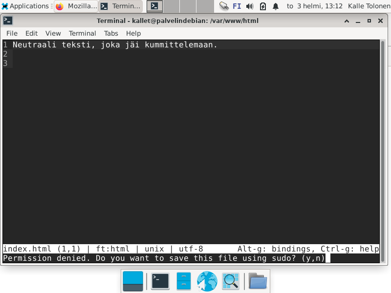  
*Myös microlla editointi tarvitsi sudo-oikeudet. Micro osasi kysyä niitä ja täytin ne terminaalissa ennen tallentamista.*  
  
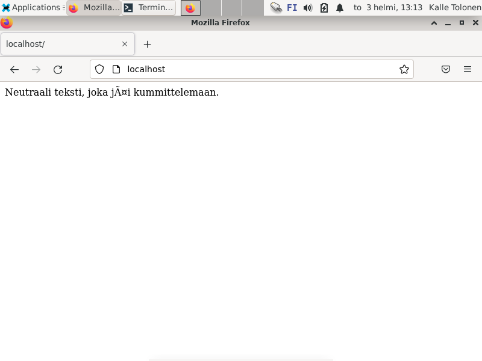  
*Päivitetty localhostin sivu*  

## b) Laita käyttäjien kotisivut (http://example.com/~tero) toimimaan. Testaa esimerkkikotisivulla.

Tein uuden käyttäjän komennolla:  
*sudo adduser kallet01*  

Syötin kaikki tarpeelliset tiedot ja tuloksena oli uusi käyttäjä.  
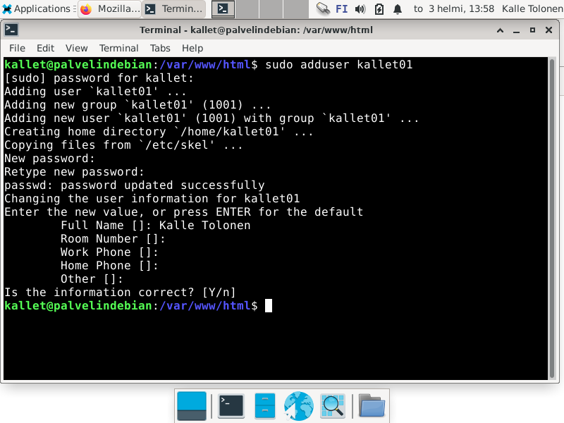  
*Uuden käyttäjän luominen sujui hyvin*  

Siirryin kallet01-käyttäjän kotihakemistoon /home/kallet01 ja loin sinne kansion "public_html" komennolla:  
*sudo mkdir public_html*  
  
Pääkäyttäjän oikeuksia tarvittiin luomiseen, sillä olin kirjautunut sisään toisella käyttäjätunnuksella.  

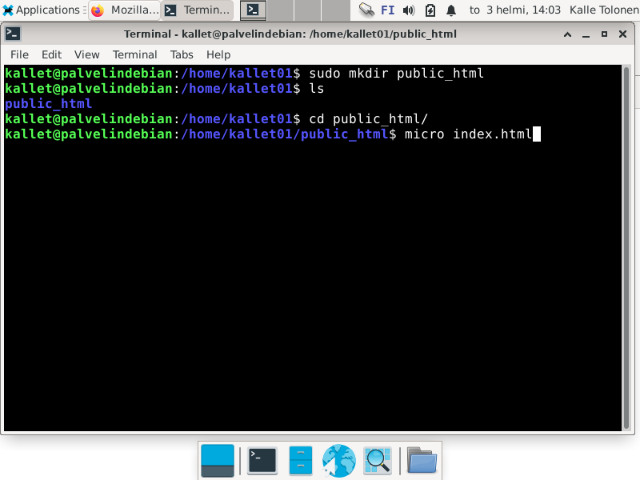  
*Tässä luotiin uusi index.html-tiedosto micro-editorilla*  
  
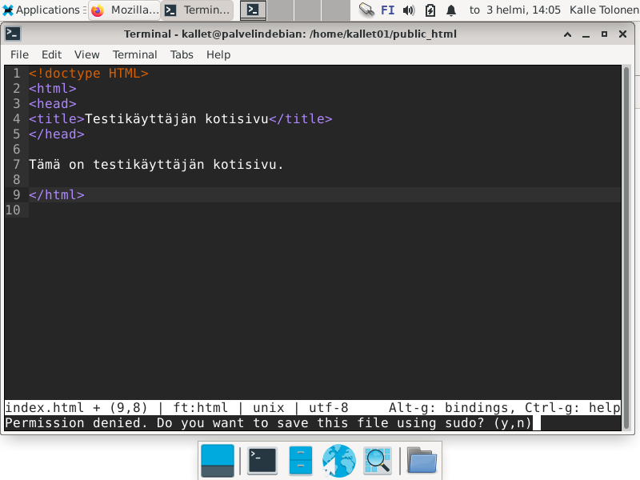  
*Unohdin jälleen käyttää sudoa micron ajamiseen, mutta onneksi se osasi pyytää valtuuksia myös jälkikäteen*  
  
Iteroin index.html-tiedoston läpi cat-komennolla:  
*cat index.html*  

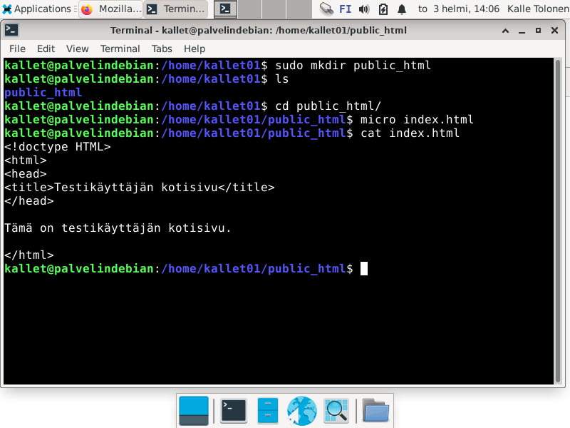  

Lopuksi tarkistin selaimesta, että käyttäjällä kallet01 on todella localhostilla pyörivä kotisivu. Sitä ennen tuli vielä ajaa komennot:  
*sudo systemctl a2enmod userdir*  
*sudo systemctl restart apache2*  
  
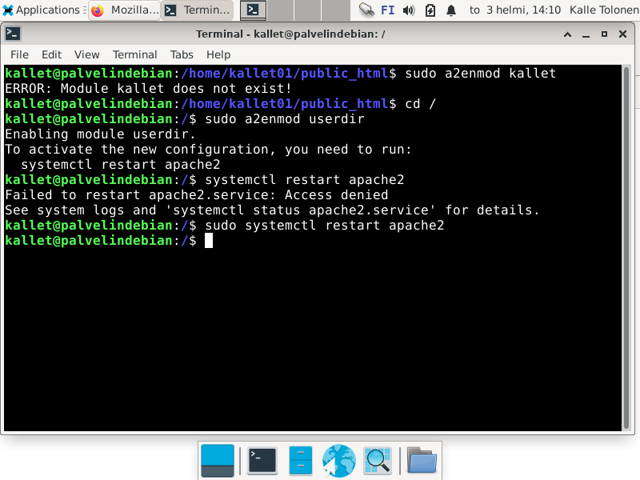  
*Ensimmäinen komento luutavasti määritti käyttäjähakemistot aktiivisiksi apache2-daemonille. Tiedän että jälkimmäinen käynnisti daemonin uudestaan.*  

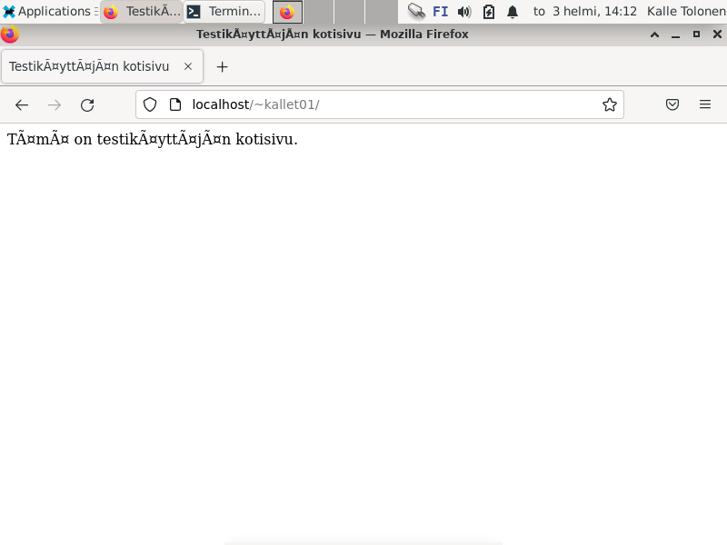  
*Kotisivut olivat localhostilla pyörimässä onnistuneesti*  
  
Lopetin tehtävien täyttämisen tältä erää ja kello oli 14.15.  

## c) Tee validi HTML5 sivu, ja testaa sen toiminta https://validator.w3.org

Tein jo ylläolevassa esimerkissä miltei validin html5-sivun, mutta päätin korjata siitä kauneusvirheet, eli puuttuvat ääkköset ja kielitiedon.  
  
Siirryin kallet01-käyttäjän kotihakemistoon ja siellä public_html-kansioon ja editoin microlla index.html-tiedostoa.  
  
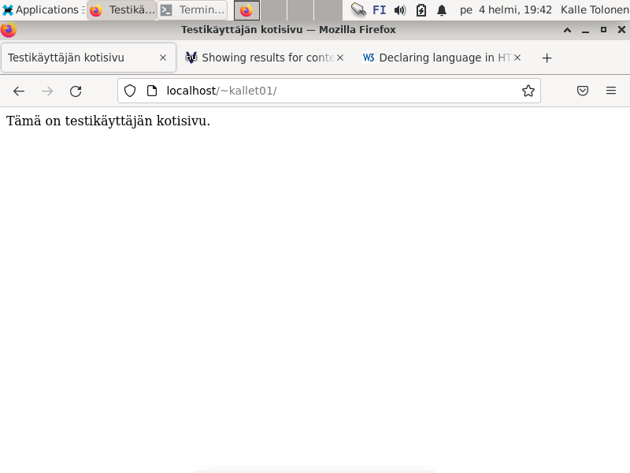  
*Lopputulos selaimessa*  
  
Lopuksi tarkistin lähdekoodin klikkaamalla selaimessa hiiren oikealla napilla "View Page Source"-valintaa.  
  
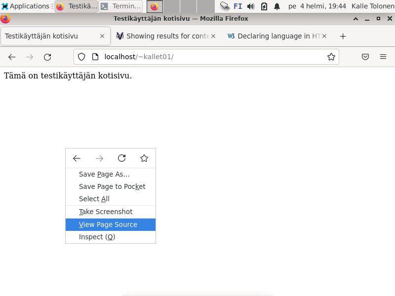  
*Sivuston lähdekoodin näyttäminen*  
  
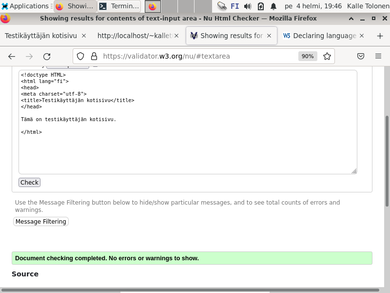  
*Validoinnin tuloksena oli standardin mukainen html5-sivu*  
  
## d) Surffaa oman palvelimesi weppisivuja. Etsi Apachen lokista esimerkki onnistuneesta (200 ok) sivulatauksesta ja epäonnistuneesta (esim 404 not found) sivulatauksesta. Analysoi rivit eli kerro jokaisesta rivistä niin paljon yksityiskohtia kuin osaat.
  
Aloitin työt uudelleen n. 14.50.  
  
Yritin siirtyä olettamaani apache2-lokikansioon hakemistossa:  
*/var/log/apache2*  
  
Kohtasin kuitenkin "access is denied"-ilmoituksen, joten yritin ajaa cd-komentoa sudolla.  

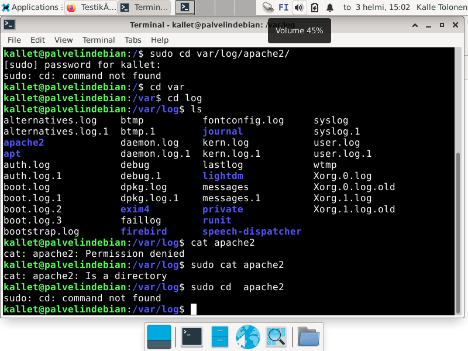  
*Sudo ei tunnistanut cd-komentoa*  
  
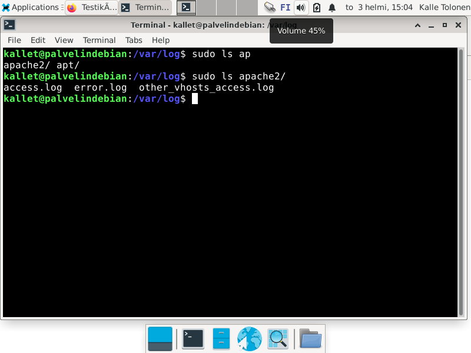  
*sudo ls-komento pystyi kuitenkin listaamaan hakemiston sisällön*  
  
Lokit saatiin avattua ja etsittyä sieltä epäonnistunut sivulataus.  
  
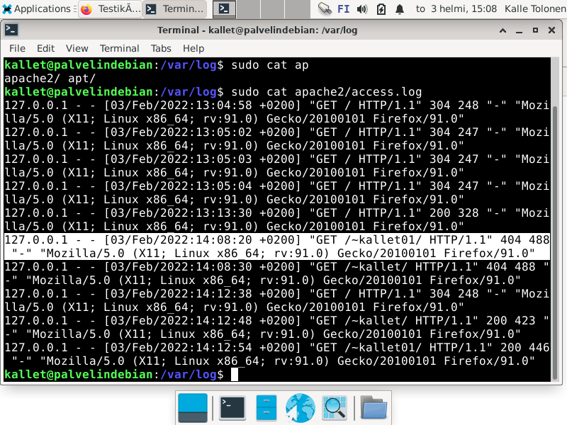  
*Korostettuna epäonnistunut sivulataus*  
  
** Analyysi:**  
1. IP-osoite (localhost tässä tapauksessa)  
2. Aikaleima  
3. Backendille lähetetty kutsu, tässä tapauksessa GET
4. Osoite jota GET-käskyllä kutsuttiin ja protokolla
5. Virheilmoitusten tunnisteet: [404](https://en.wikipedia.org/wiki/HTTP_404) (sivua ei löydy) ja [488](https://knowledgebase-iframe.polycom.com/kb/viewContent.do;jsessionid=172A396E013F34FA5174D2BA3ABEE42B?externalId=45626) (pyyntöä ei hyväksytty)
6. Selaimen ja käyttöjärjestelmän versiot, selaimen ytimen version
  
  
*Korostettuna onnistunut sivulataus*  
  
** Analyysi:**  
1. IP-osoite (localhost tässä tapauksessa)  
2. Aikaleima  
3. Backendille lähetetty kutsu, tässä tapauksessa GET
4. Osoite jota GET-käskyllä kutsuttiin ja protokolla
5. Ilmoitusten tunnisteet [200](https://developer.mozilla.org/en-US/docs/Web/HTTP/Status/200) (sivulataus ok) ja 446, jonka merkitys ei auennut hakukoneenkaan kautta
6. Selaimen ja käyttöjärjestelmän versiot, selaimen ytimen version
  
Latasin git-palvelimelle työn viimeisimmän vaiheen 15.27.  
  
## f) Tee palvelimella ajettava weppiohjelma, joka tekee käyttäjälle jonkin yksinkertaisen laskun (esim. painoindeksi BMI)

Aloitin työt 19.40.  
  
Päätin lähteä haastamaan itseäni ja valitsin viimeiseksi tehtäväksi dynaamisen nettisivun.  
  
Hain netistä tietoa ja aloitin urakan ohjeilla: http://wiki.centos-webpanel.com/apache-run-python-script  
  
Ensimmäisenä tarkistin, että python on asennettu koneelle komennolla:
*python -V*  
  
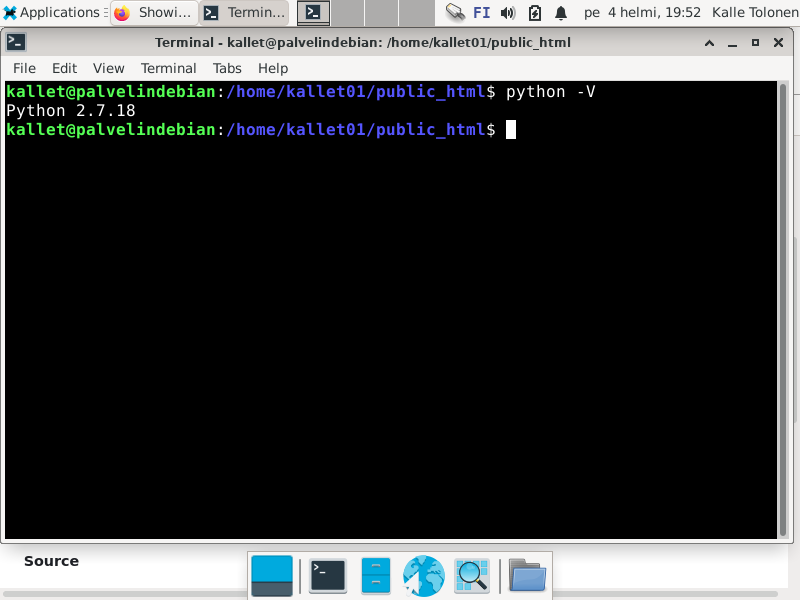  
*Python oli asennettu*  

Seuraavaksi tein ohjeen mukaisesti testikäyttäjäni kotihakemiston /public_html-kansioon uuden alakansion cgi-bin ja sinne test.py-tiedoston:  
*sudo mkdir cgi-bin*  
*sudo micro cgi-bin/test.py*  

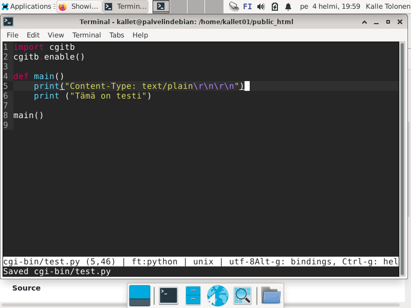  
*Lähteen lähdekoodista muokattu testitiedosto*  
  
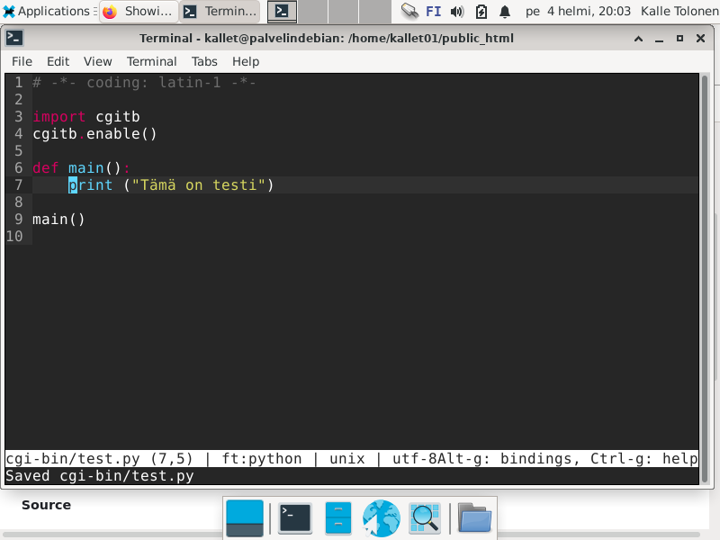  
*Korjasin koodiani ja laitoin ääkköset toimimaan tulosteessa*  
  
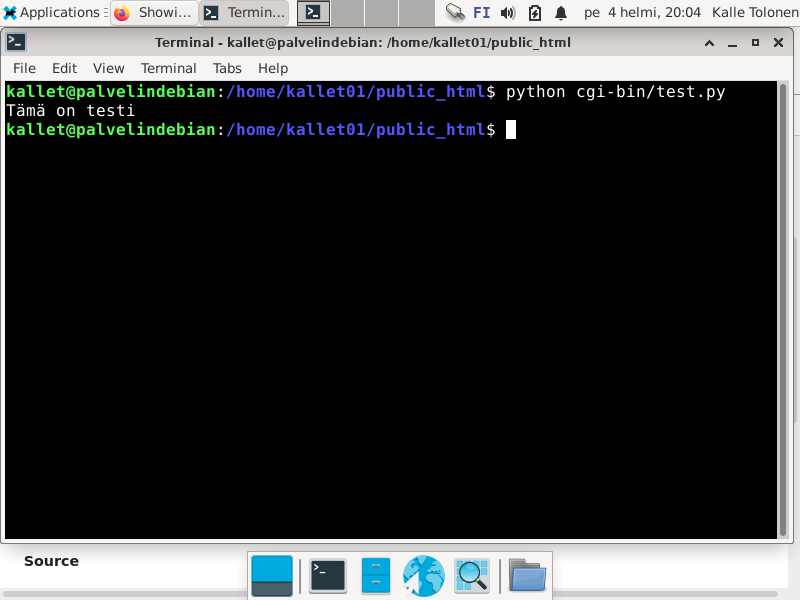  
*Ohjelman pystyi ajamaan komentokehotteesta*  
  
Päivitin kansion ja tiedoston käyttöoikeudet komennoilla:  
*chown -R kallet01.kallet01 /home/kallet01/public_html/cgi-bin*  
*chmod +x /home/kallet01/public_html/cgi-bin/test.py*  
  
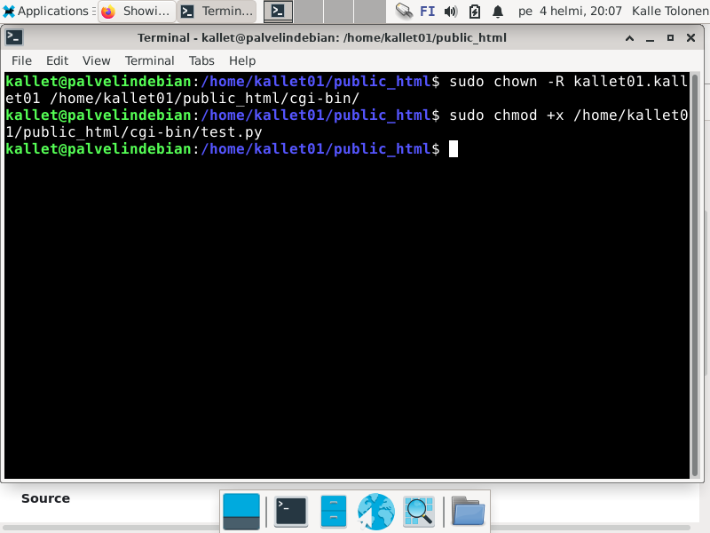  
*Käyttöoikeuksien päivitystä*  
  
Seuraavaksi tein ohjeiden mukaisen .htaccess-tiedoston cgi-bing-kansioon.  
  
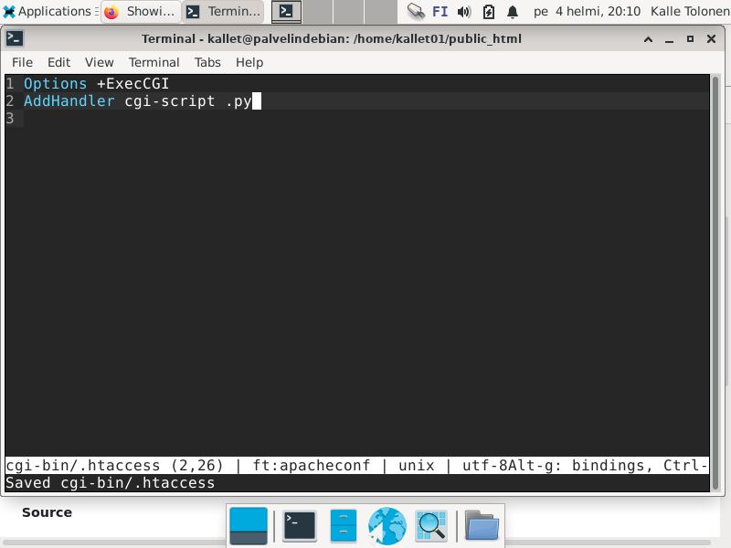  
*Tiedoston sisältö*  
  
Sitten vuorossa oli mod.cgid.conf-tiedoston luominen.  
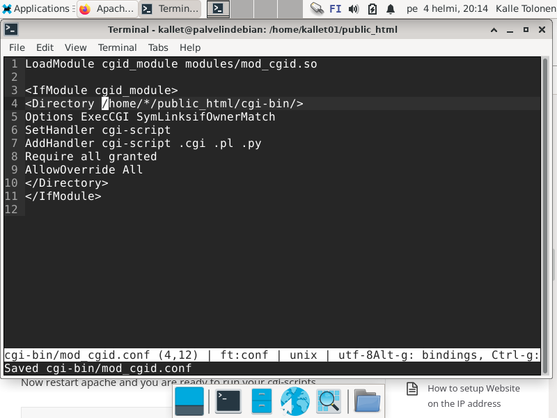  
*Tiedoston sisältö*  
  
Seuraavaksi käynnistin httpd-palvelun uudestaan komennolla:  
*sudo systemctl restart apache2.service*  
  
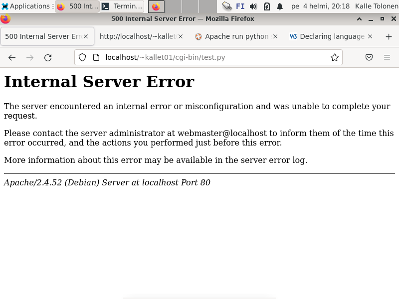  
*Kuten kuvasta näkyy, ei lopputulos ollut toivotun kaltainen*  
  
Päätin diagnosoida ongelmaa palvelimen virhelokeista:  
*sudo ls /var/log/apache2/*  
*sudo cat /var/log/apache2/error.log*  
  
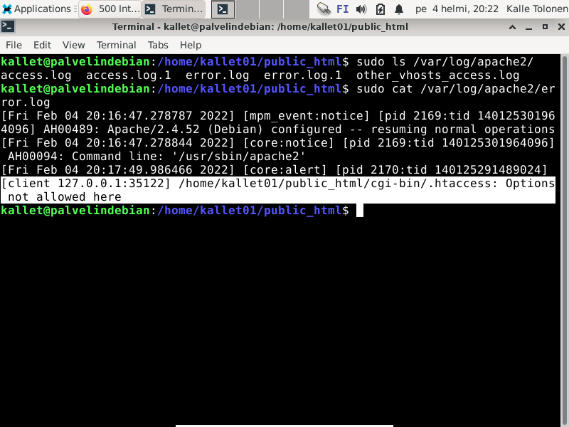  
*Päättelin lokista, että ohjeen kaltainen .htaccess-tiedosto ei ole sallittu serverikonfiguraatiossani*  
  
Etsin seuraavan [ohjeen](https://www.server-world.info/en/note?os=Debian_9&p=httpd&f=5).  

[a2enmod](http://manpages.ubuntu.com/manpages/trusty/man8/a2enmod.8.html) alkoi kiinnostamaan sen verran, että piti etsiä lisätietoa siitä, ja selvisi että a2enmod hoitaa  apache2-daemonissa eri moduulien käyttöönoton.  
  
Syötin seuraavat komennot:  
*sudo a2enmod cgi*  
*systemctl restart apache2.service*  
  
  
*Daemoni käynnistettiin jälleen uudestaan*  
  
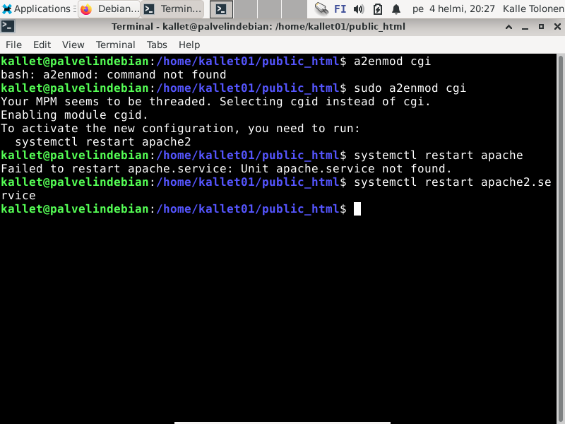  
*Muokkasin ohjeen tiedostoa*  
  
Syötin komennot:  
*sudo aen2conf cgi-enabled*  
*sudo systemctl reload apache2*  
  
Ohjeilla en päässyt enää eteenpäin niitä soveltaen, joten päätin [etsiä uudet](https://www.linux.com/training-tutorials/configuring-apache2-run-python-scripts/).  
  
Ohjeet olivat vajavaiset, eikä niissä ollut jokaista askelta erikseen selitettynä, vaan niissä viitattiin toisaalla oleviin [dokumentteihin](https://httpd.apache.org/docs/2.2/howto/cgi.html).  

Menin tarkistamaan, että httpd-konffauseni olisi oikea komennoilla:  
*cat /etc/apache2/apache2.conf | grep Load*  

Ohjeessa mainitusta LoadModulesta ei löytynyt jälkeäkään konffaustiedostosta.  

Päätin lopettaa tältä illalta ja kello oli 21.12.  
  
## Uusi yritys ##  
Aloitin työt uudestaan 7.36.

Tällä kertaa työohjeenani oli: https://stackoverflow.com/questions/44871139/how-do-i-run-python-cgi-script-on-apache2-server-on-ubuntu-16-04  

Aloitin komennolla:  
*sudo micro /etc/apache2/apache2.conf*  
-Tällä komennolla editoin apache2:n konfiguraatiotiedostoa.  
  
```
Lisäsin ohjeen mukaisesti apache2.conf-tiedoston loppuun määrittelyt CGI-scripteistä: ´´´´´´
#########     Adding capaility to run CGI-scripts #################  
ServerName localhost  
ScriptAlias /cgi-bin/ /var/www/cgi-bin/  
Options +ExecCGI  
AddHandler cgi-script .cgi .pl .py
```
  
Avasin seuraavan tiedoston komennolla:  
*sudo micro /etc/apache2/conf-available/serve-cgi-bin.conf*  

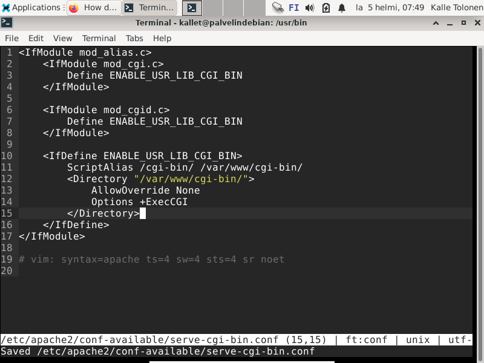  
*Uusi serve-cgi-bin.conf*  
  
Käynnistin daemonin uudestaan:  
*sudo systemctl restart apache2.service*  
  
Loin testihakemiston ja -tiedoston:  
*sudo mkdir /var/www/cgi-bin*  
*sudo micro /var/www/cgi-bin/first.py*  

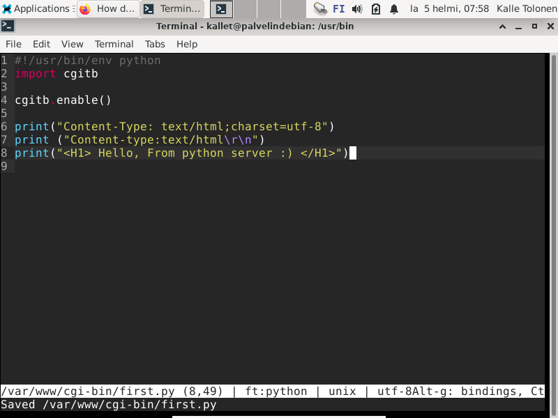  
*Testitiedoston ohjelmakoodi*  
  
Tiedostolle annettiin ajo-oikeudet komennolla:  
*sudo chmod +x /var/www/cgi-bin/first.py*  
  
Lopuksi testasin onnistumiseni selaimella.  
  
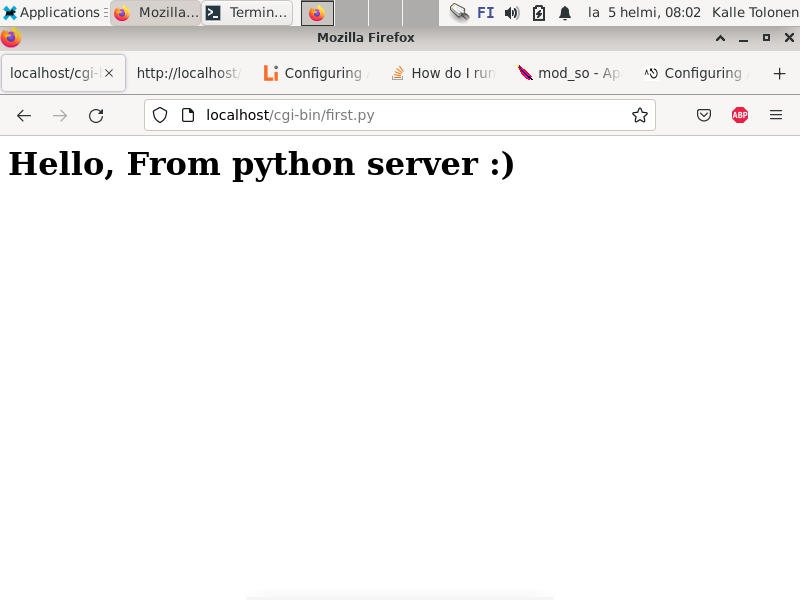  
*Selain tulostaa pythonin printtaaman html:n*  
  
## BMI-laskuri ##  
  
Käyttämäni työohje oli: https://towardsdatascience.com/how-to-easily-run-python-scripts-on-website-inputs-d5167bd4eb4b  
  
Käytin tunnin sen toteuttamiseen, mutta en saanut sitä toimimaan, joten oli aika ottaa seuraava [työohje](https://www.xmodulo.com/create-use-python-cgi-scripts.html) työn alle.  
  
Loin testihakemiston ja -tiedoston:  
*sudo mkdir /var/www/cgi-bin*  
*sudo micro /var/www/cgi-bin/bmi.py*    
  
Tiedostolle annettiin ajo-oikeudet komennolla:  
*sudo chmod +x /var/www/cgi-bin/bmi.py*  
  
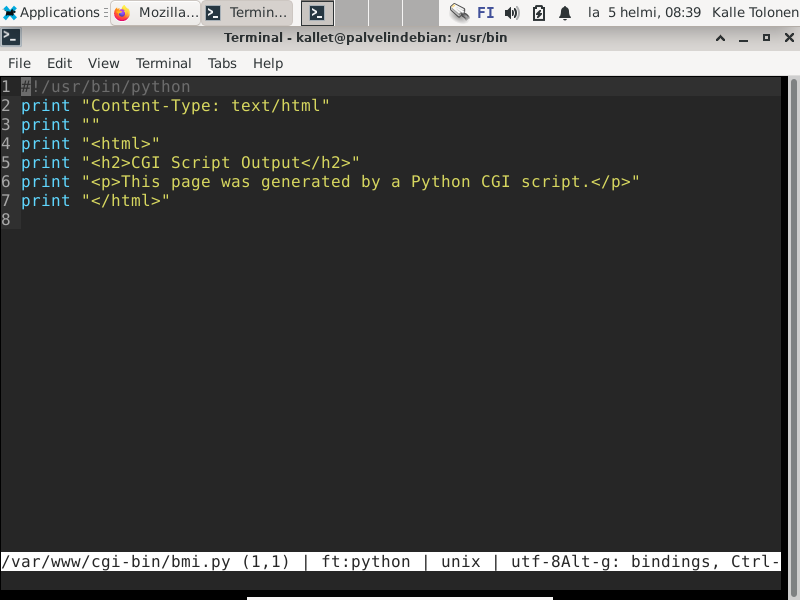  
*bmi.py-tiedoston sisältö /cgi-bin-kansiossa*  
  
Tällä kertaa ohje on toimiva, ja saan nappulan välittämään painalluksen ja pythonin ajamaan itsensä.  
  
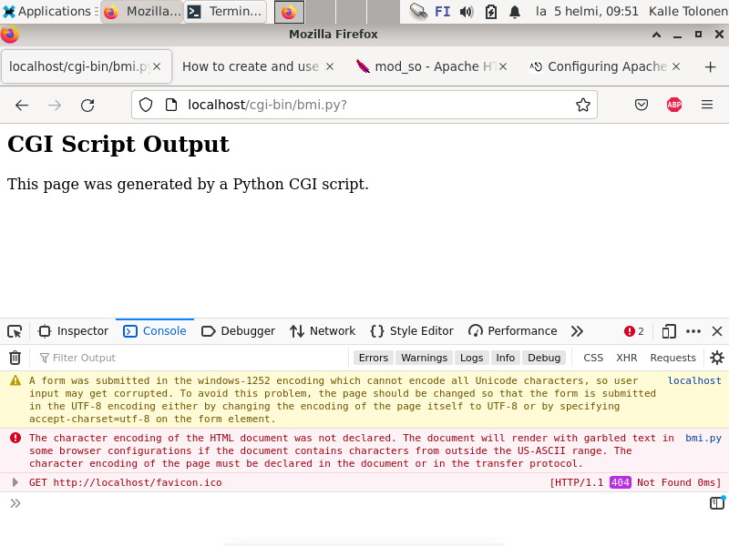  
*Python tuotti html-koodia*  

Seuraavaksi muokkasin index.html ja bmi.py-tiedostoja.  

**index.html**:  

```
<html>
<h1>BMI-laskuri</h1>
<form name="input" action="/cgi-bin/bmi.py" method="get">
Pituus: <input type="text" name="pituus"><br>
Paino: <input type="text" name="paino"><br>
<input type="submit" value="Submit">
</form>
</html>
```
  
**bmi.py**    
  
```
#!/usr/bin/python
# -*- coding: latin-1 -*-
 
import cgi
form = cgi.FieldStorage()
pituus = float(form["pituus"].value)
paino = float(form["paino"].value)
bmi = paino / (pituus**2)
viesti = ''
 
if bmi <= 19:
    viesti = 'Olet alipainoinen'
elif bmi <= 25:
    viesti = 'Olet normaalipainoinen'
else:
    viesti = 'Olet ylipainoinen'
 
print "Content-Type: text/html"
print ""
print "<html>"
print "<meta charset=\"utf-8\">"
print "<a href=\"/index.html\">Takaisin alkuun</a>"
print "<h2>Painoindeksisi on</h2>"
print "<p>"
print "Laskennassa käytetyt tiedot:<br>"
print "<b>Pituus:</b> ", pituus, "<br>"
print "<b>Paino:</b> ", paino, "<br>"
print "Painoindeksisi on: ", bmi, "<br>"
print viesti
print "</p>"
print "</html>"
```  
  
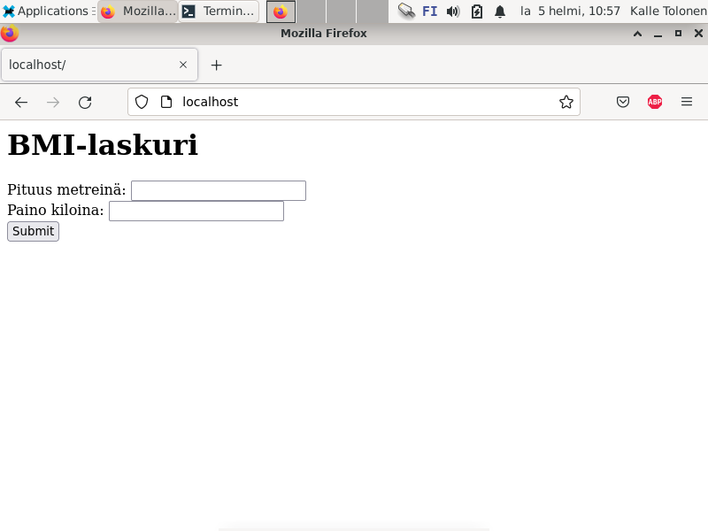  
*Toimiva index.html*  
  
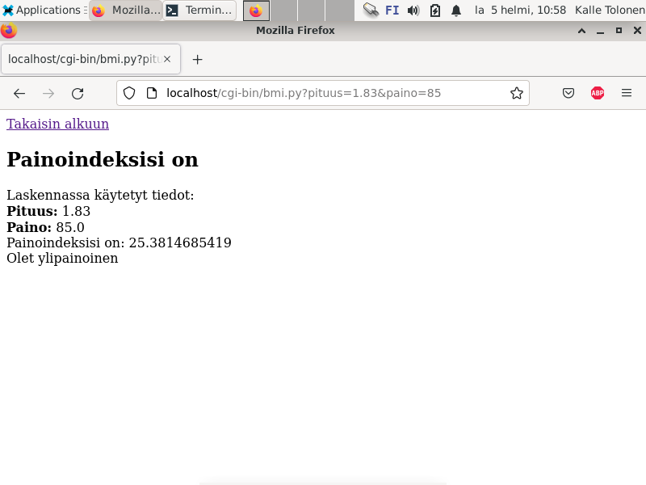  
*Totuus: olin ylipainoinen*  
  
Lopetin tehtävän tekemisen 10.59 ja latasin viimeistelyä vailla olevan dokumentin Githubiin.

*Tekijä: Kalle Tolonen*
