# **Harjoitus 4**

Aloitin työt 19.30

Harjoitustyön tehtävänantona käytettiin Karvisen kotisivuilta löytyvää [h4-kohtaa](https://terokarvinen.com/2021/linux-palvelimet-ict4tn021-3018/#h4)

**Harjoituksen laitekokoonpano**  
*Järjestelmänä Win 11 + VirtualBox 6.0*  
  
*Koneen perustiedot:*  
*Suoritin: AMD Ryzen 9 5900HS 8-ytiminen 3,1 - 4,5 GHz, 16 Mt välimuisti*  
*Muisti: 16 Gt LPDDR4X*  
*Näytönohjain: NVIDIA GeForce RTX 3050 Ti 4 Gt GDDR6*  
*Kiintolevy: 512 Gt M.2 2230 NVMe PCIe 3.0 SSD*  

## a) Pilvi. Vuokraa ja asenna oma julkinen palvelin Internetiin. Vuokraa nimi osoittamaan siihen. (Jos sinulla on jo oma palvelin, ks kohta b. Jos et halua vuokrata palvelinta, ks kohta c. Jos haluat kokeilla vuokrattavia palveluita ilmaiseksi, voit käyttää GitHub Education pakettia tai eri pilvioperaattoreiden ilmaisia tutustumistarjouksia.)  

Olin ennen kurssia päätynyt jo hankkimaan GitHubin Education packagen, joten sen hankkimista en valitettavasti pystynyt raporttiin dokumentoimaan. Se onnistui kuitenkin koulun (Haaga-Helian) opiskelijasähköpostin avulla.  
Päädyin valitsemaan palveluntuottajikseni [NameCheapin](https://www.namecheap.com/) ja [Digital Oceanin](https://www.digitalocean.com/). Kirjoitushetkellä tarjouksena oli ilmainen .me-domain yhdeksi vuodeksi NameCheapista ja 100$ krediittejä VPS(Kubenets)-palveluun Digital Oceanilla.  
  
Ensimmäiseksi työkseni kirjauduin sisään GitHub Educationiin sinne rekisteröidyttyäni:  
https://education.github.com/globalcampus/student  
  
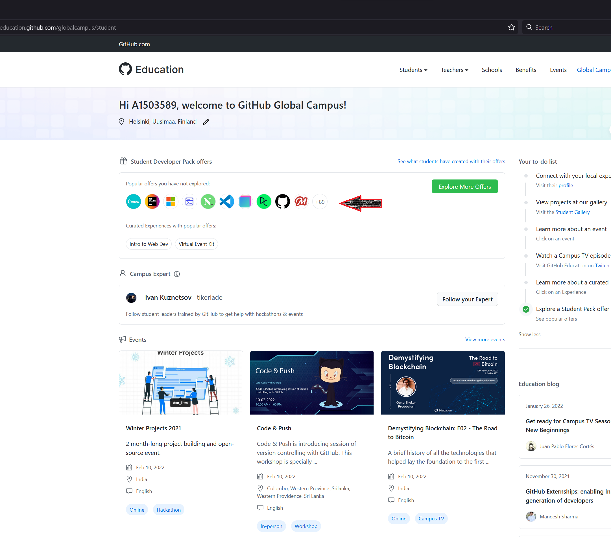  
*Etusivunäkymä*  
  
Klikkasin Student Developer Pack-osaston [logoja](https://education.github.com/pack/offers#namecheap). Valitsin ensimmäiseksi NameCheapin.  
  
  
*NameCheapin ja Digital Oceanin mainokset*  
  
Klikkasin [NameCheapin](https://nc.me/github/auth) linkkiä. Ehdin jo valitettavasti rekisteröimään .me-domainin aiemmin, joten loput kuvakaappaukset ovat .com-domainin ostoprosessista.  
  
  
*Saatavuus tarkistettiin useiden domainien osalta automaattisesti.*  
  
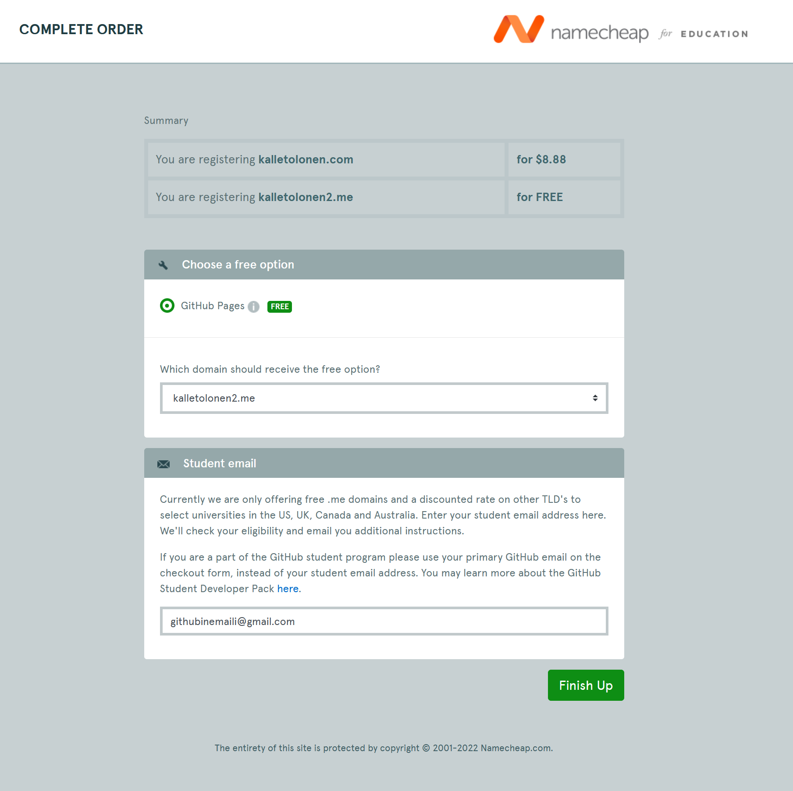  
*Valitsin GitHub Pages toiminnon*  
  
Sähköpostikenttään syötin pääasiallisen GitHub-tilini sähköpostiosoitteen. Seuraavalla sivulla luotiin muistaakseni käyttäjätunnus ja salasana. Valitettavasti tämä osa projektista jäi dokumentoimatta.  
  
  
*Näkymä kirjautuneena näytti tältä*  
  
Painoin manage-nappulaa.  
  
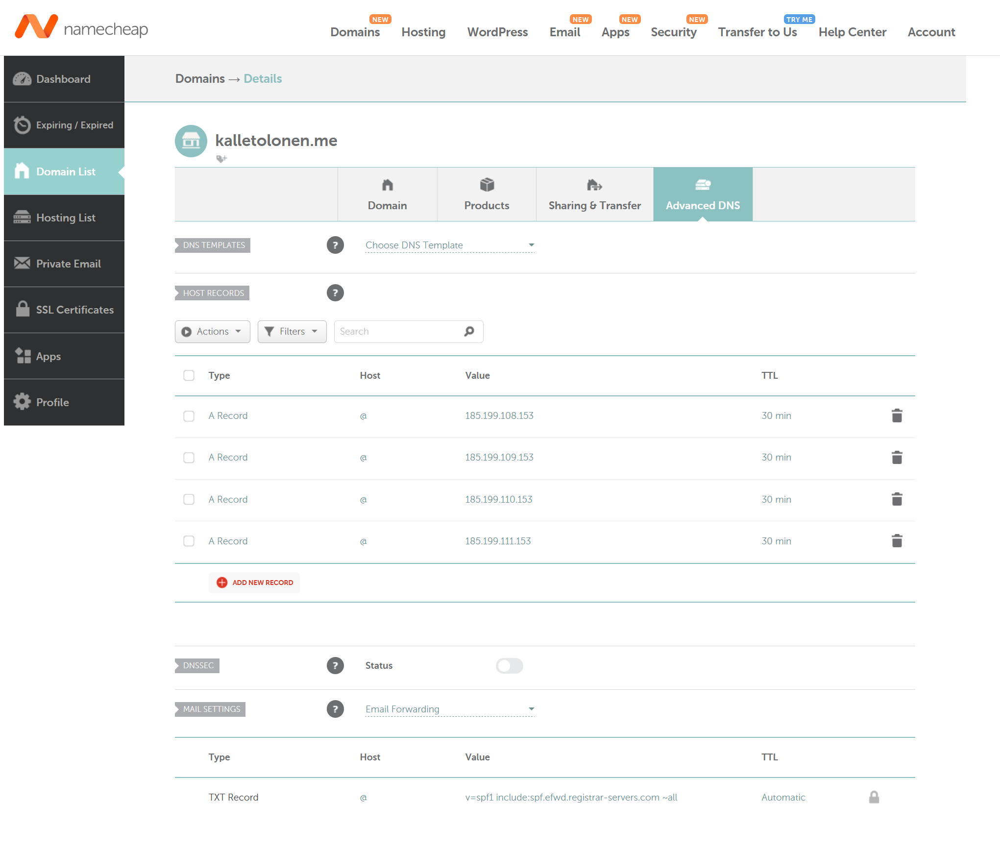  
*Valitsin Advanced DNS-asetukset*  
  
Hyvin piilotetusta näkymästä paljastui, että domainini TTL(Time To Live)-aika oli aika pitkä.  
  
Seuraavaksi oli aika pystyttää pilvipalvelin. Digital Oceanille sai etukoodin klikkaamalla GitHub Educationin talteen ja pasteamalla sen palveluun.  
  
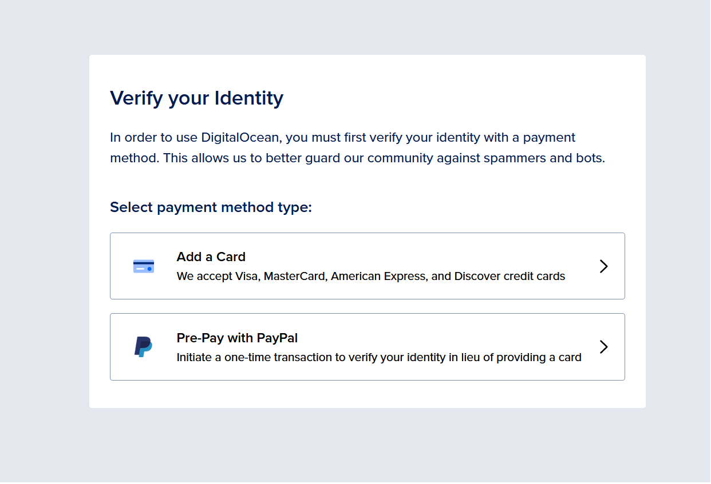  
*Palvelu vaatii rekisteröitymisen jälkeen luottokortin tai PayPalin. Valitsin luottokortin.*  
  
Digital Ocean veloitti kortilta henkilöllisyyden tarkistamiseksi yhden dollarin. Ymmärrykseni mukaan summa hyvitetään asiakkaalle takaisin.  

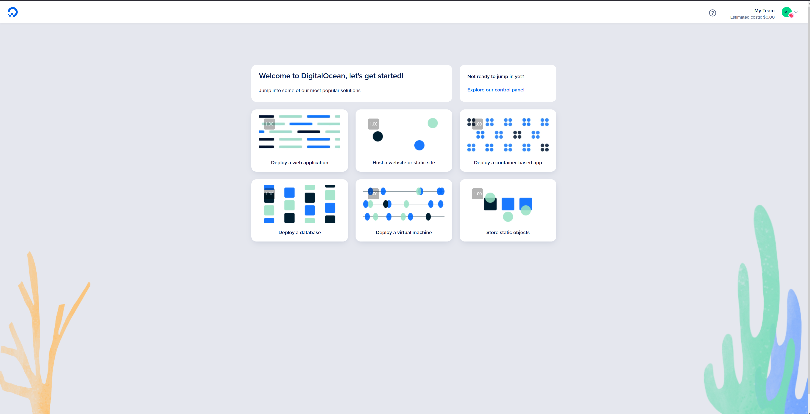  
*Sisäänkirjautumisnäyttö oli sekavahko*  
  
Klikkasin My Teamia, josta pääsin tililleni ja sieltä pystyin valitsemaan "Go to My Team"-valinnan. Klikkailin itseni Billing-alasivulla ja rullasin näkymän alas asti, jotta pääsin syöttämään etukoodin.  
  
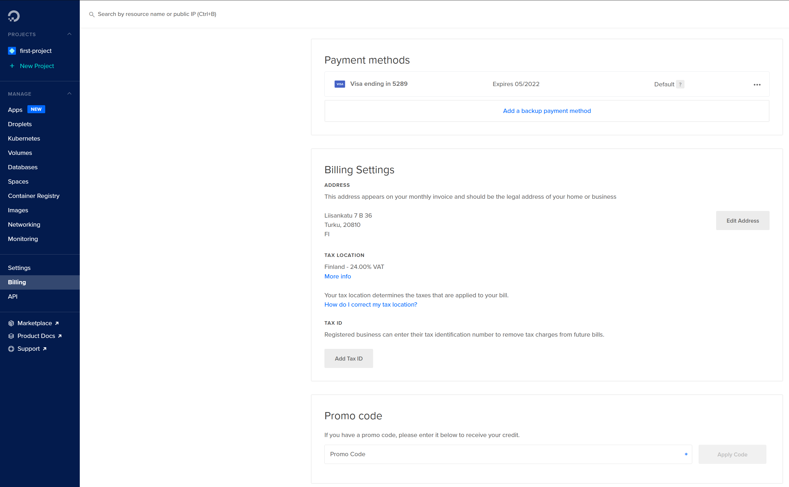  
*Etukoodi GitHub Educationista syötettiin tänne*  
  
Siirryin Droplets-valintaan vasemmassa reunassa.  
  
  
*Droplets -> Create a Droplet*  
  
**Valintani:**  
1. Debian
2. Shared CPU Basic
3. Regular Intel with SSD
4. Palvelinkeskus Euroopassa (Frankfurt), koska GDPR-säännökset
5. Authenticattion "Password"
6. Mitäänsanomaton hostname, valitsin itselleni "linux"
7. Create a Droplet  
  
Virtuaalipalvelin asenteli itseään hetken valitulta levykuvalta, jonka jälkeen sen löysi "first-project"-projektin alta.  

**Nimipalvelimen ja linux-palvelimen saattaminen yhteen**  
  
Kirjauduin sisään NameCheapiin ja valitsin Domain Listista domainini kohdalta Adcanced DNS-valinnan. Tänne tein kaksi uutta recordia "Add New Record"-painikkeella, joille annoin molemmille tyypiksi "A record" ja toiselle hostiksi "@", sekä toiselle "www".  
  
    
*Tältä näytti valmis konfigurointi*  
  
## d) Suuri muuri. Suojaa palvelin tulimuurilla. Muista ensin reikä ssh-palvelimelle.  
  
  
*Näkymässä linux-droplet*  
  
Kopioin ip-osoitteen ja yhdistin siihen ssh:lla virtuaalikoneeni komentokehotteesta:  
*ssh root@ip-osoite*  

Syötin laatimani salasanan komentokehotteessa ja pääsin sisään palvelimelle. Ensimmäisenä päivitin saatavilla olevat paketit komennolla:  
*sudo apt-get update*  
  
Asensin palomuurin komennolla:  
*sudo apt-get ufw*  

Tein reiän palomuuriin ssh-liikenteelle porttiin 22/tcp komennolla:  
*sudo ufw allow 22/tcp*  
  
Laitoin palomuurin päälle komennolla:  
*sudo ufw enable*  
  
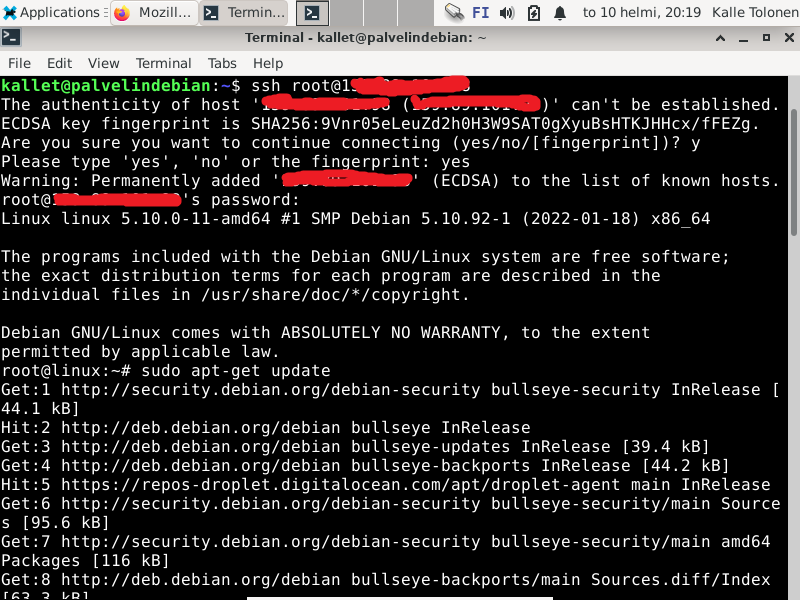  
*SSH-kirjautuminen*  

Lopetin työt 20.30

Aloitin työt 16.30 junan lähtiessä Turusta Helsinkiin.  
  
Kirjauduin sisään palvelimelle komennolla:  
*ssh root@ip-osoite*  
  
Loin uuden käyttäjän komennolla:  
*sudo adduser kallet*  
  
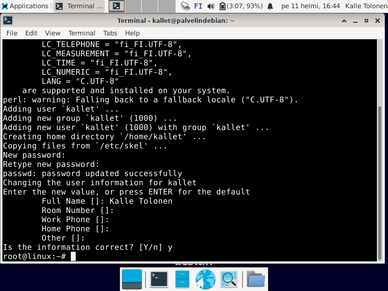  
*Syötin uudelle käyttäjälle turvallisen salasanan ja tunnuksen luominen onnistui.*  
  
Seuraavaksi lisäsin kallet-käyttäjän sudo-oikeudellisten käyttäjien ryhmään:  
*sudo adduser kallet sudo*  
  
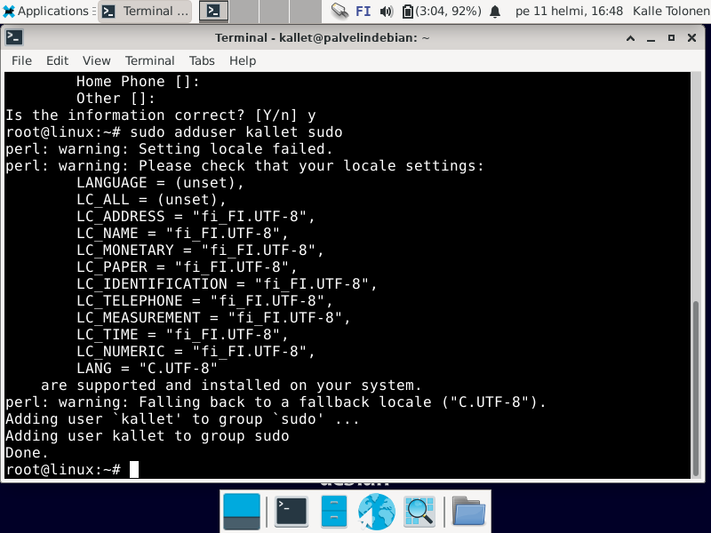  
*Käyttäjän lisääminen sudo-ryhmään onnistui*  
  
Kirjauduin ulos ssh-yhteydestä root-käyttäjällä ja sisään uudelleen uudella käyttäjällä komennoilla:  
*exit*  
*ssh kallet@ip-osoite*  

Testasin vielä sudo-oikeudet ajamalla järjestelmään uusimmat päivitykset komennoilla:  
*sudo apt-get update*  
*sudo apt-get dist-upgrade*  

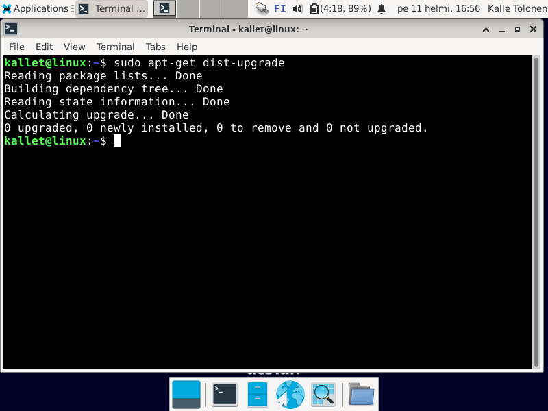  
*Käyttäjällä oli oikeudet ajaa järjestelmäpäivitykset*  

Tämän jälkeen lukitsin root-käyttäjän komennolla:  
*sudo usermod --lock root*  
  
## e) Served. Laita koneellesi Apache-weppipalvelin. Korvaa testisivu. Laita käyttäjän kotisivut toimimaan. Kokeile eri koneelta, esim. kännykällä, että sivut toimivat. Vinkki: tee kotisivut normaalina käyttäjänä public_html/ alle.  
  
Asensin Apachen komennolla:  
*sudo apt-get update*  
*sudo apt-get install -y apache2*  
  
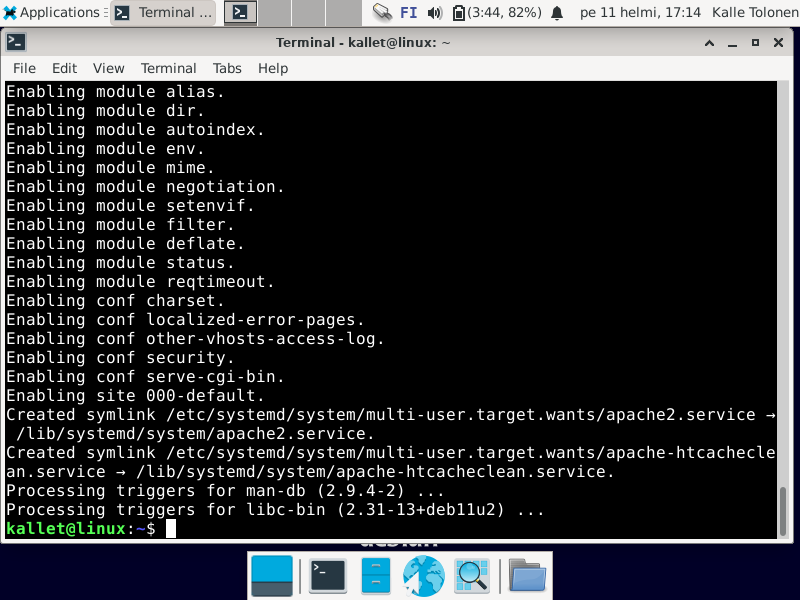  
*Apache2 asentui nikottelematta*  
  
Käynnistin daemonin ja tarkistin sen käynistymisen:  
*sudo systemctl start apache2.service*  
*sudo systemctl status apache2.service*  
  
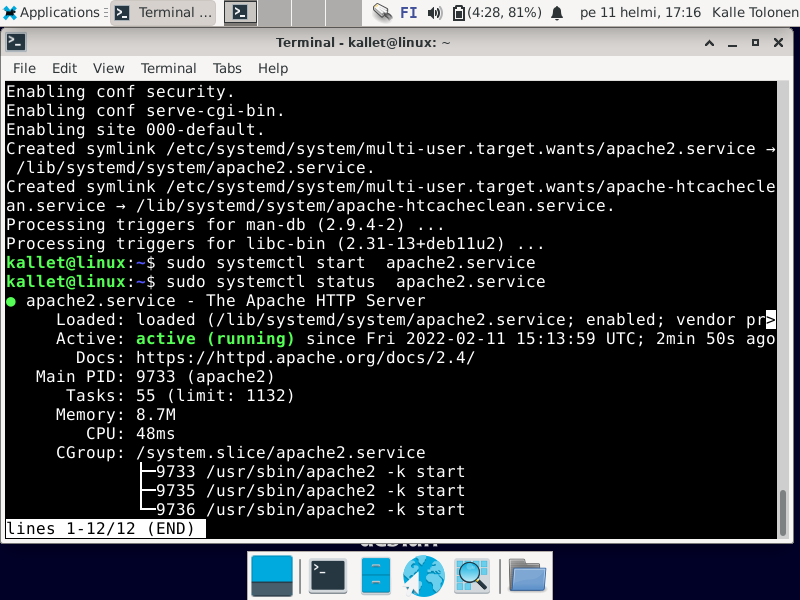  
*Käynnistynyt daemoni*  
  
  
*En muistanut puhkaista palomuuriin aukkoa, joten netistä en päässyt kiinni sivustoon*  
  
Tein palomuuriin aukon komennolla:  
*sudo ufw allow 80/tcp*  
  
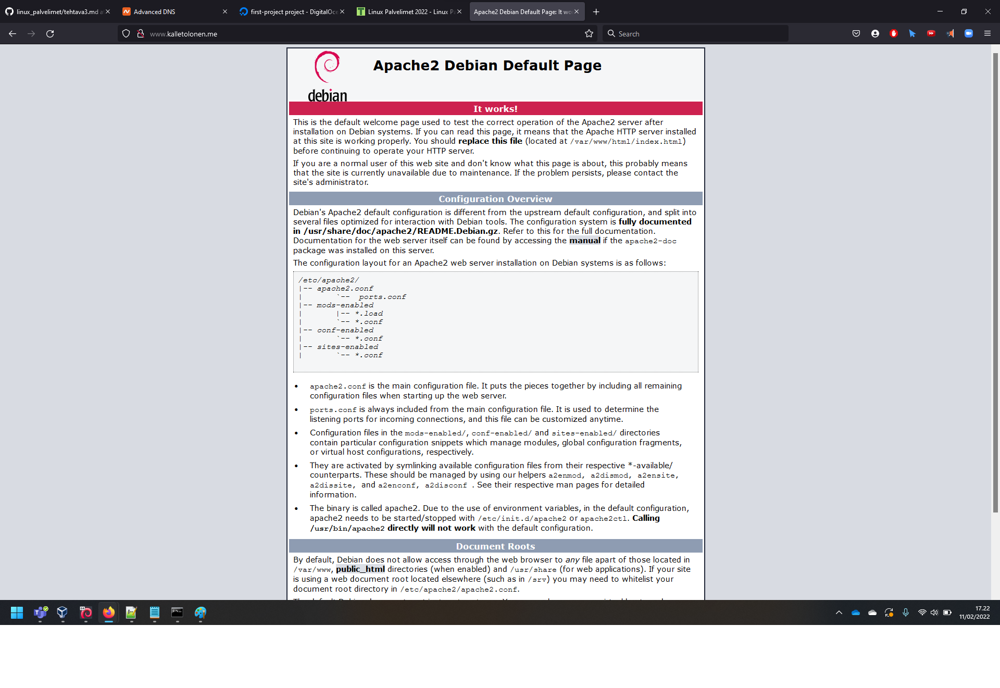  
*Reiän tekeminen palomuuriin ratkaisi ongelman*  
  
Siirryin kallet-käyttäjän kotihakemistoon (/home/kallet) ja tein sinne public_html alakansion:  
*mkdir public_html*  

Tein index.html tiedoston putkella:  
*echo moi |tee index.html*  

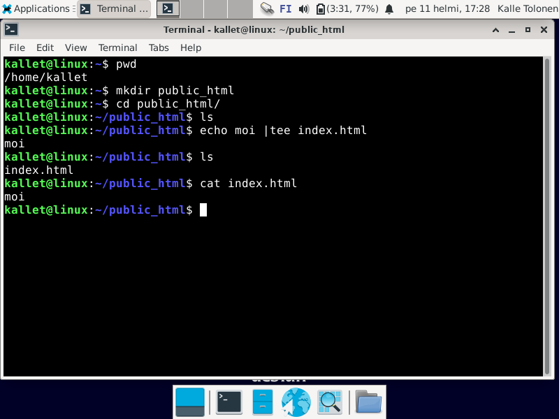  
*Vastaluotu index.html iteroituna*  
  
Seuraavaksi kerroin Apachelle, että haluan [käyttäjien hakemistot saataville palvelimelta](https://websiteforstudents.com/setup-apache2-userdir-module-on-ubuntu-16-04-lts-servers/):  
*sudo a2enmod enable*  
*sudo systemctl restart apache2*  
  
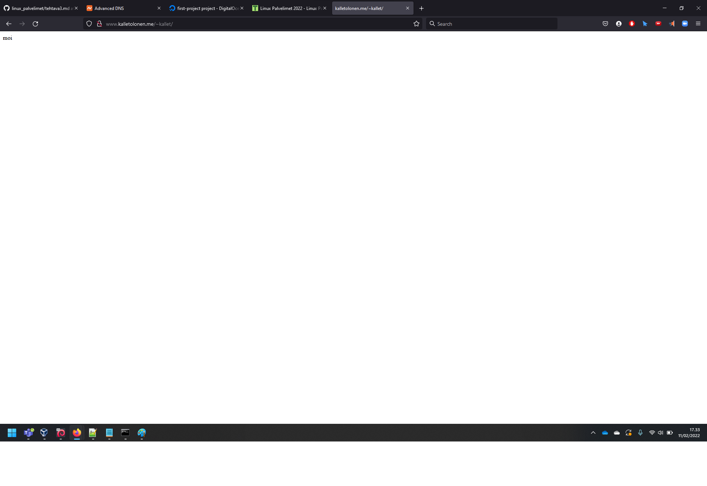  
*Lopputuloksena on julkisessa internetissä näkyvillä oleva kallet-hakemiston index.html*  
  
## f) Päivitys. Päivitä palvelimesi kaikki ohjelmat.  
  
Päivitin palvelimeni kaikki ohjelmat komennoilla:  
*sudo apt-get update*  
*sudo apt-get dist-upgrade*  
  
  
*Palvelimeni oli ajan tasalla*  

Lopetin työt 17.48 ja latasin version GitHubiin.  
  
## g) Rosvot porteilla. Etsi lokeistasi merkkejä murtautumisyrityksistä ja analysoi ne.  
  
Aloitin työt 13.57.  
  
Avasin Apache2:n lokitiedoston komennolla:  
*sudo cat var/log/apache2/access.log*  

  
*Yliviivattu lokirivi kiinnitti huomioni*  
  
1. Kyselyn tehneen koneen ip-osoite  
2. RFC 1413 identity of the client-tieto ei saatavilla
3. Kyselyn tehneen käyttäjätunnus ei ole saatavilla
4. Aikaleima  
5. Palvelimelle lähetetyn kutsun tyyppi ja sisältö  
-Arvioin, että palvelimelle on yritetty lähettää GET-kutsulla käskyä, joka lähettäisi löydöksensä wgetillä hyökkääjän haluamaan osoitteeseen  
6. Kyselyyn tuotettu vastaus (400 - pyyntöä ei voida käsitellä)
7. Vastauksen koko
8. Järjestelmän tietoja, jotka puuttuvat hyökkääjältä. Tässä olisi käytetty selain, käyttöjärjestelmä, prosessoriperhe ja selaimen versio 
9. Selainytimen tyyppi ja versio  
  
Avasin listasta vielä toisen pyynnön eritellyt rivin komennolla:  
*sudo cat var/log/apache2/access.log  |grep Gpon*  
  
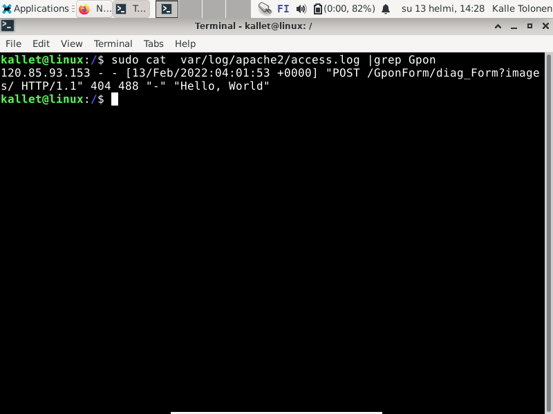  
*Gponform-yrityksen lokirivi*  

1. Kyselyn tehneen koneen ip-osoite  
2. RFC 1413 identity of the client-tieto ei saatavilla
3. Kyselyn tehneen käyttäjätunnus ei ole saatavilla
4. Aikaleima  
5. Palvelimelle lähetetyn kutsun tyyppi ja sisältö  
-Arvioin, että palvelimelle on yritetty lähettää POST-kutsun avulla hyökkäys, jolla saataisiin Dasanin valmistamana reititin haltuun 
6. Kyselyyn tuotettu vastaus (404 - not found)
7. Vastauksen koko
8. Järjestelmän tietoja, jotka puuttuvat hyökkääjältä. Tässä olisi käytetty selain, käyttöjärjestelmä, prosessoriperhe ja selaimen versio 
9. Selainytimen tyyppi ja versio, tässä tapauksessa klassinen ohjelmointiprinttaus  
  
Lähde lokimerkintöjen tyypeille: https://httpd.apache.org/docs/2.4/logs.html  
Lähde Gponform-hyökkäykselle: https://security.stackexchange.com/questions/204096/how-do-the-cve-2018-10562-and-cve-2018-10561-exploits-work

## h) Vapaaehtoinen: Etusivu uusiksi. Laita weppipalvelimesi etusivu (http://example.com/ eikä http://example.com/~tero) näkyviin, tietysti niin, että sivuja voi muokata normaalin käyttäjän oikeuksin ja ne ovat jonkun käyttäjän kotihakemistossa.  
  
Lähde: https://stackoverflow.com/questions/5891802/how-do-i-change-the-root-directory-of-an-apache-server  
  
Käytin komentoa:  
*ls etc/apache2/sites-available/*  

Tämä listasi hakemiston tiedostot, ja päätin avata 000-default.conf-tiedoston komennolla:  
*sudo micro tiedosto*  
  
Olin unohtanut, että en ollut asentanut Microa vielä tälle palvelemelle, joten korjasin virheeni:  
*sudo apt-get update*  
*sudo apt-get install -y micro*  
  
    
*DocumentRoot-parametri*

Löysin tiedostosta lupaavan DocumentRoot-parametrin ja päätin editoida sitä. Syötin tilalle käyttäjän kallet tekemän aiemman sivun kansion.  
  
Tämän jälkeen käynnistin daemonin uudestaan:  
*sudo systemctl restart apache2*  

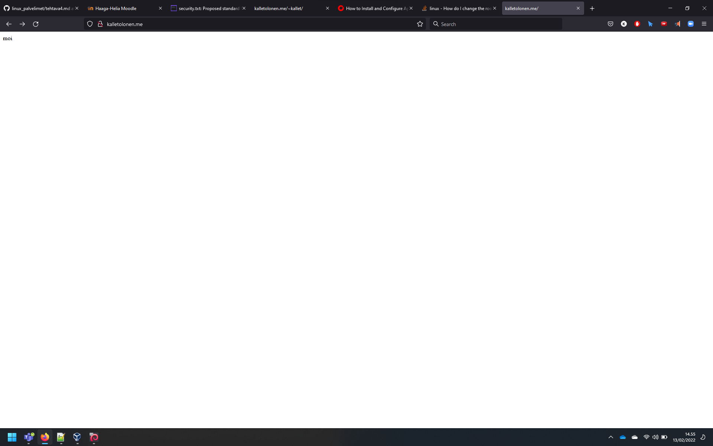  
*Daemonin uudelleenkäynnistämisen jälkeen julkisessa netistä löytyivät sivut oikeasta osoitteesta*  
  
Lopuksi kirjauduin palvelimeltani ulos komennolla:  
*exit*  

Lopetin työt 15.00 ja latasin viimeisimmän version tehtävistä Git-repositoriooni.  
    
##  i) Vapaaehtoinen: Laita TLS-salakirjoitus (https) toimimaan Let's Encrypt avulla. Vinkki: certbot tai lego.  
  
Aloitin työt n. 18.30.  
  
  
  
Googletin vinkin hakusanoilla itseni EFF:n sivuille, josta löysin kätevän [työohjeen](https://certbot.eff.org/instructions?ws=apache&os=debianbuster). Ohje oli tosin Debianin versiolle 10 ja serverilläni pyöri versio 11, mutta ajattelin selviäväni tästä soveltamalla.  
  
Kirjauduin serverilleni Windowsin komentokehotteesta komennolla:  
*ssh kallet@kalletolonen.me*  
  
Asensin snapd-työkalun (ja päivitin samalla järjestelmän):  
*sudo apt-get update*  
*sudo apt-get install -y snapd*  
*sudo snap install core; sudo snap refresh core*  
*sudo apt-get dist-upgrade*
  
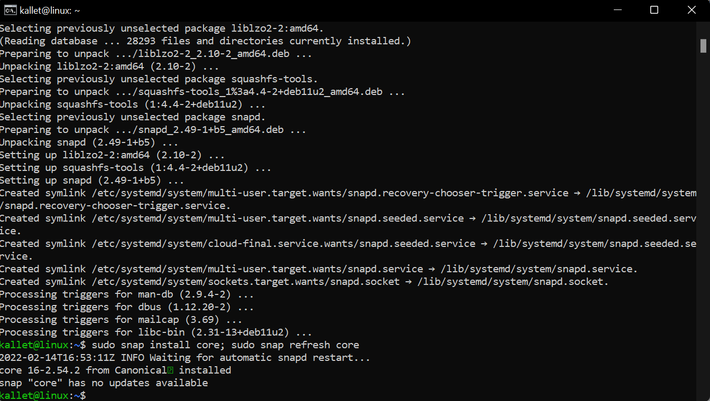  
*Snapin core päivitettiin*  
  
Seuraavaksi oli vuorossa Certbotin poistaminen järjestelmästä:  
*sudo apt-get remove certbot*  
  
  
*Certbottia ei ollut asennettu*  
  
Asensin ohjeen mukaisesti Certbotin:  
*sudo snap install --classic certbot*  
  
Loin linkin eri sijaintien välille:  
*sudo ln -s /snap/bin/certbot /usr/bin/certbot*  
  
Valitsin oletusasetukset komennolla:  
*sudo certbot --apache*  
  
  
*Sertifikaatti myönnettiin välittömästi!*  
  
Certbotissa oli sisäänrakennettu sertifikaatin uusiminen, joten testasin vielä sen toiminnan ja ajastimen olemassaolon:  
*sudo certbot renew --dry-run*  
*systemctl list-timers*  
  
  
*Ajastin oli pyörimässä sertifikaatin säännölliseen uusimiseen.*  
  
Käynnistin daemonin uudestaan:  
*sudo systemctl restart apache2.service*  
  
Testasin osoitetta selaimessa ja en päässyt sinne, vaikka olin käynnistänyt Apache2-daemonin uudestaan.  

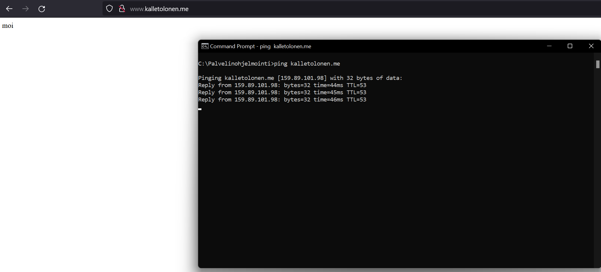  
*DNS-serveri ei ohjannut enää domainia ip-osoitteeseen, kun kokeilin https-alulla*  
  
En siis täysin onnistunut tehtävässäni, mutta onneksi asioista voi ottaa selvää ja päivitän tämän sitten kun minulle selviää missä meni vikaan.  
  
Lopetin työt 19.38.
  
**Päivitys:**  
Onnistuin saamaan sertifikaattini toimimaan puhkaisemalla 443-porttiin reiän palomuuriin:  
*sudo ufw allow 443/tcp*  

  
*HTTPS toimii*  

