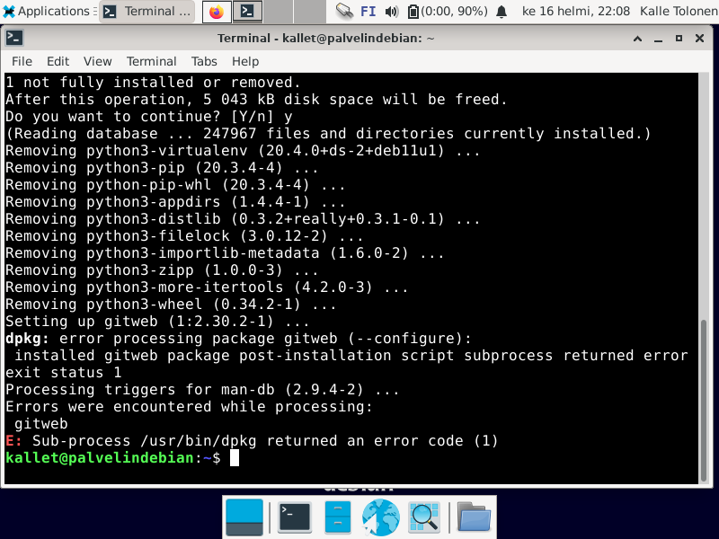
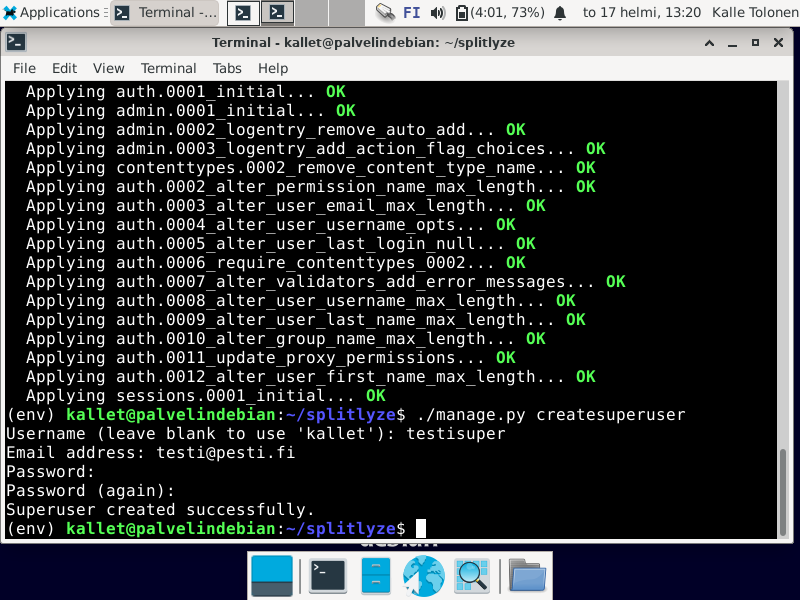
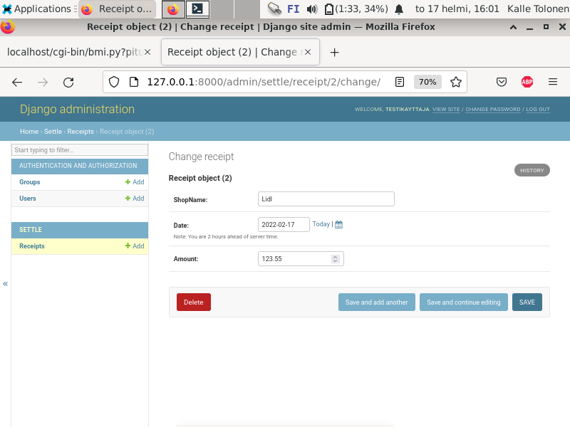
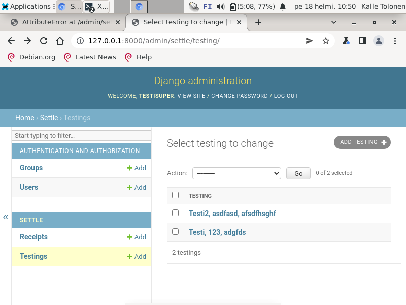

# **Harjoitus 5**

Aloitin työt 12.10.


Harjoitustyön tehtävänantona käytettiin Karvisen kotisivuilta löytyvää [h4-kohtaa](https://terokarvinen.com/2021/linux-palvelimet-ict4tn021-3018/#h5)

**Harjoituksen laitekokoonpano**  
*Järjestelmänä Win 11 + VirtualBox 6.0 + Debian 11*  
  
*Koneen perustiedot:*  
*Suoritin: AMD Ryzen 9 5900HS 8-ytiminen 3,1 - 4,5 GHz, 16 Mt välimuisti*  
*Muisti: 16 Gt LPDDR4X*  
*Näytönohjain: NVIDIA GeForce RTX 3050 Ti 4 Gt GDDR6*  
*Kiintolevy: 512 Gt M.2 2230 NVMe PCIe 3.0 SSD*  

## a) CRUD. Make a simple web program, that allows multiple users modify the same data. Have user accounts and logins. You can use Django development server and admin interface here. Single table is enough. We already did a Customer (CRM) database, so it might be interesting to do something as simple, but slightly different.

Tehtävän lähteenä käytin tuntimuistiinpanojani ja Karvisen [artikkelia](https://terokarvinen.com/2022/django-instant-crm-tutorial/).  
  
Ensin poistin virtualenvin, jotta pääsin asentamaan ohjelmat alusta pitäen:  
*sudo apt-get purge virtualenv*  
  
  
*Virtualenv poistettiin onnistuneesti, pl. gitwebiä koskeva virheilmoitus*  
  
Järjestelmä kehotti poistamaan myös muita paketteja, joita ei enää tarvita, joten ajoin sen ehdottaman komennon:  
*sudo apt autoremove*  
  
  
*gitweb-paketista jäi edelleen virheilmoitus*  
  
Päätin kokeilla gitwebin poistamista:  
*sudo apt-get purge gitweb*  
  
  
*Käsky kommentoi jotain Apacheen liittyvää, joten tarkistin, että palvelin oli edelleen päällä*  
  
  
*Palvelin pystyi edelleen ajamaan pythonia*  
  
  
*Poistin tuntiharjoituskessa luomani tiedoston ja hakemistot sisältöineen*  
  
Aloitin asennustyöt komennolla:  
*sudo apt-get install -y virtualenv*  

Komento haki ja asensi koneelle virtaulenvin, jonka avulla voidaan luoda eristettyjä Python-ympäristöjä.  
  
  
*Asennus sujui ilman virheilmoituksia*  
  
Seuraavaksi oli aika saa virtuaaliympäristö päälle komennoilla:  
*virtualenv --system-site-packages -p python env/*  
*source env/bin/activate*  
  
  
Ensimmäinen komento loi kansion env, jossa on saatavilla tuoreimmat paketit kansiosta lib/sitepackages/. Jälkimmäinen komento käynnisti virtuaaliympäristön.  
  
  
*Lopputulos*  
  
Tarkistin, että olin virtuaaliympäristön sisällä, jotta en vahingossa tee asennuksia jonnekin aivan toisaalle:  
*which pip*  
  
  
*Olin oikeassa paikassa*  
  
Editoin Microlla tiedostoon vaatimukseksi Djangon:  
*micro requirements.txt*  

  
*Django lisättiin vaatimuslistaan ainoaksi merkinnäksi*  

Seuraaavaksi laittiin pip asentamaan django requirements.txt-tiedostosta ja tarkistettiin Djangon versionumero:  
*pip install -r requirements.txt*  
*django-admin --version*  
  
  
*Versio oli sama kuin ohjeessa*    
  
Loin projektin komennolla:  
*django admin startproject splitlyze*  
  
Sen jälkeen siirryin projektikansioon ja laitoin kehitysserverin päälle:  
*cd splitlyze*  
*./manage.py runserver*  
  
  
*Great success!*  
  
Seuraavaksi oli aika laittaa Djangon admin-konsoli toimimaan:  
*./manage.py makemigrations*  
*./manage.py migrate*  
  
  
*Komennot päivittivät projektin tietokannat*  
  
Asensin pwgen-salasanageneraattorin ja loin sen avulla superuserilleni tietoturvallisen salasanan.
  
**superuserin luominen**  
*sudo apt-get install pwgen*  
*pwgen -s 30 1*  
*./manage.py createsuperuser*  
   
  
*Käyttäjän luominen onnistui*  
   
  Tämän jälkeen käynnistin testiserverin:  
*./manage.py runserve*  

  
*Pääsin kirjautumaan sisälle konsoliin*  

Päätin myös avata toisen terminaalin ja antaa serverin pyöriä toisessa, jotta sitä ei tarvitsi jatkuvasti käynnistellä. Siirryin kotihakemistoon ja kirjoitin komennon:  
  
*source env/bin/activate*
  
Tein saman which pip-varmistuksen kuin ylempänä, jotta pystyin olemaan varma siitä, että olin virtuaaliympäristön sisällä.  
  
Lopetin työt 13.33.  

Aloitin työt 14.32.  

Loin weppikäyttöliittymästä toisen käyttäjän ja annoin tälle kaikki oikeudet.  

  
*testikayttaja-käyttäjälle annettiin Staff- ja Superuser status*  
  
  
*En päässyt kirjautumaan, epäilin syyksi vääriä tunnistetietoja*  
  
Tein testikayttaja-userin uudestaan ja kirjauduin onnistuneesti.  
  
  
*Sisäänkirjautuminen onnistui toisella kerralla*  
  
  
*testikayttaja-tunnuksella oli nyt staff- ja superuser-oikeudet*  
  
Palasin komentokehotteeseen ja lisäsin projetiini ensimmäisen app:n, sekä merkinnän siitä asetustiedostoon:  
*./manage.py startapp settle*  
*micro splitlyze/settings.py*  
  
  
*Näkymä Micron editoidusta kohdasta, johon lisäsin oman appini*  
  
Tämän jälkeen oli aika lisätä malleja:  
*micro /settle/models.py*  
    
  
*Kirjoittamani python-koodi*  
  
Ensin tiedostoon tuotiin models django.db:stä ja sitten luotiin luokka Receipt, joka peri models.Modelin ominaisuudet. Tarkoituksenani on pitkässä juoksussa luoda maksujen jakamiseen ja talouden seuraamiseen & analysointiin sopiva työkalu. Muutin myös Micron oletusasetuksen tabulaattorien automaattisesta muuttamisesta välilyönneiksi. Pythonissa ohjelmalohkojen hierarkiaa ilmaistaa vain sisennyksillä ja siten on äärimmäisen tärkeää, että sisennykset ovat oikein.  

**Tabulaattorin toiminnan muuttaminen tapahtui seuraavasti:**  
*ctrl + e*  
*set tabtospaces false*  
  
Tallensin kirjoittamani koodin ja tein tietokantamigraatiot komentokehotteesta:  
*./manage.py makemigrations*  
  
  
*Virheilmoituksen perusteella päättelin, että olin tehtyt kirjoitusvirheen parametrissä "max_lenght"*  
  
  
*Korjattu kirjoitusasu*  
  
  
*Seuraava virheilmoitus vihjasi, että DecimalFields kaipasi myös uutta parametriä max_digits*  
  
  
*Arvelin, että parametrit voitaisiin erotella toisistaan pilkulla*  
  
  
*Tällä kertaa ./manage.py makemigrations teki tehtävänsä mukisematta*  
  
Makemigrationsin onnistuttua annoin komennon:  
*./manage.py migrate*  

Makemigration luo migraatiot ja migrate suorittaa tietokantamigraatiot.  
  
Jäljellä oli vielä rekisteröinnin tekeminen admin.py-tiedostoon:  
*micro settle/admin.py*  
  
  
*Admin.py:n uusi sisältö*  
  
Tässä kerrottiin, että admin.siteen rekisteröidään Receipt-malli, joka perii models-luokan ominaisuudet.  
  
  
*testikayttaja pystyi lisäämään objekteja*  
  
Käyttökelpoisuuden parantamiseksi lisäsin models.py-tiedostoon päivämäärän:  
*micro settle/models.py*  
  
  
*Muokattu models.py*  
  
  
*Kehitysserveri kertoi virheeestä sisennyksessä*  
   
  
*Debuggaaminen etenee, päättelin fiksuista virheilmoituksista, että minun täytyy löytää oikea tapa ilmaista mitä parametristä haluan*  
  
  
*Kokeilin formsin tuomista epäonnistuneesti*  
  
  
*Yritin myös periyttää luokkaan kahdesta eri luokasta*  
  
  
*Lopulta päädyin vain käyttämään modelsin DateFieldiä*  
  
  
Ajoin makemigrationin ja pääsin päättämään mitä lomakkeeseen syötetään oletusarvona.  

  
*Lopputuloksena objekteillani oli nyt kolme ominaisuutta (shopName, date & amount)*  
  
Lopuksi muokkasin models.py:tä siten, että objektilistaus näyttäisi mukavammalta admin-konsolissa:  
*micro settle/models.py*  
  
  
*Muokattu models.py*  
  
  
*Päivitetty admin-näkymä*  
  
Yritin saada riville tulostumaan myös hinnan, mutta sitten objektin muokkausta yrittäessä sain virheilmoituksen tuplesta (shopName, amount ja date lienevät tuple-muotoon tallennettuja) ja objektia kutsuttaessa saatiin aikaiseksi virheilmoitus.  
  
  
*Tähän asti sain returnilla palautettua objektista haluamani tiedot*  
  
  
*Pyysin objektia palvelimelta ja tuloksena oli virheilmoitus*  
  
Lopetin työt n. 22.15 taukojen jälkeen.  
    
Aloitin työt n. 10.00.  
    
Päätin testata toimiiko ominaisuuksien iterointi, jos kaikki attribuutit ovat samaa datatyyppiä ja loin Testing-luokan muokkaamalla models.py-tiedostoa.  
  
  
*Uusi models.py:n sisältö*  
  
Rekisteröin muutokset tietokantaan ja suoritin ne komennoilla:  
*./manage.py makemigrations*  
*./manage.py migrate*  
  
Tämän lisäksi piti vielä muokata admin.py-tiedostoa komennolla:  
*micro settle/admin.py*  
  
  
*admin.py:n uusi sisältö*  
  
  
*admin-konsolin näkymässä pyytämäni tiedot tulostuivat*  
  
  
*Koin saman virheilmoituksen myös samantyyppisiä ominaisuuksia sisältävällä objektilla*  
  
Kokeilin vielä __str__:n vaihtamista __init__:iin.  
  
  
*models.py:n uusi sisältö*  
  
  
*En ollut yhtään lähempänä ongelmani ratkaisua*  
  
Ymmärräkseni Pythonista ei riittänyt ongelman ratkaisuun, joten poistin Testing-luokan ja viittaukset siihen admin.py:stä ja tein tietokantamigraation uudestaan palatakseni alkutilanteeseen.  
  
Päivitän artikkelia, kun saan ongelman ratkaistua.  
  
## b) Prod. Make a production style Django install. Use Apache and mod_wsgi, disable DEBUG.  
  
Aloitin tuotantotyyppisen asennuksen tekemisen käyttämällä työohjeenani [Karvisen artikkelia](https://terokarvinen.com/2022/deploy-django/) ja tuntimuistiinpanojani.  
  
Päätin testata taitojani suoraan julkiseen nettiin tapahtuvalla asennuksella, joten aloitin työt ottamalla ssh-yhteyden palvelimeeni komennolla:  
*ssh kayttajatunnus@domain*  
  
Asensin Microon bash-completion -lisäosan ja määritin sen vakioeditoriksi:  
*sudo apt-get install -y micro bash-completion*  
*export EDITOR=micro*  
  
  
*Edellisen tehtävän jäljiltä minulla oli käyttäjänä tehty kotisivu*  
  
Poistin nykyisen public_html-kansion, joka sijaitsi kotihakemistossani:  
*rm  -r public_html*  
  
Tämän jälkeen tein kotihakemistoon uuden kansion:  
*mkdir -p publicwsgi/splitlyze/static/*  
  
mkdir-komennon p-parametri luo alikansiot samalla kerralla.  
  
Tämän jälkeen tein index.html tiedoston sisältöineen:  
*echo "Static test page" |tee publicwsgi/splitlyze/static/index.html*  
  
Seuraavaksi määrittelin VirtualHostin sijainnit http- ja https-liikenteelle:  
*sudoedit /etc/apache2/sites-available/splitlyze.conf*  
  
  
*splitlyze.conf-tiedoston sisältö*  
  
Kytkin konfiguraatiotestiä varten edellisen konfiguraation pois päältä ja uuden päälle:  
*sudo a2ensite splitlyze.conf*  
*sudo a2dissite 000-defaul.conf*  
  
Konfiguraatio testattiin komennolla:  
*/sbin/apache2ctl configtest*  

  
*Tuloksena oli virheilmoitus ssl-sertifikaatista ja muista asioista*  
  
Päätin ensin avata ssl-konfiguraatiotiedoston:  
*sudoedit /etc/apache2/sites-enabled/000-default-le-ssl.conf*  
  
Tämä tuotti tulokseksi virheilmoituksen:  
	sudoedit: /etc/apache2/sites-enabled/000-default-le-ssl.conf: editing symbolic links is not permitted  
  
Seuraavaksi otin kokeilun alle documentrootin korjaamisen splitlyzy.conf-tiedostoon:  
*sudoedit /etc/apache2/sites-available/splitlyze.conf* 
  
[Kuva 50.](pics/harjoitus_5/50.png)  
*splitlyze.conf-tiedoston uusi sisältö*  
  
Uusi yritys:  
*/sbin/apache2ctl configtest*   
  
Virheilmoitukset pysyivät samoina, enkä tiennyt miksi, joten päätin kokeilla mitä käy, jos käynnistän serverin uudestaan, sillä voin aina palata edelliseen tehtävään ja tehdä kaikki toimenpiteet uudestaan päästäkseni takaisin alkupisteeseen.  
  
Annoin komennon:  
*sudo systemctl restart apache2**  
  
[Kuva 51.](pics/harjoitus_5/51.png)  
*Demoni käynnistyi uudestaan mukisematta*  
  
[Kuva 52.](pics/harjoitus_5/52.png)  
*Domainin juurihakemistossa tuli ilmoitus puutteellisista oikeuksista*    

[Kuva 53.](pics/harjoitus_5/53.png)  
*käyttäjän kansiossa todettiin samaa*  
  
Sudoedit ei toiminut yllä ssl-konfiguraatiotiedoston muokkaamiseen, mutta microlla sne muokkaus onnistui:  
*sudo micro /etc/apache2/sites-enabled/000-default-le-ssl.conf*  
  
[Kuva 54.](pics/harjoitus_5/54.png)  
*Uusittu DocumentRoot-parametri*  
  
[Kuva 55.](pics/harjoitus_5/55.png)  
*Tällä kertaa konfiguraatiotesti lopetti herjaamisen DocumentRootista*  
  
Jäljelle jäänyt virheilmoitus liittynee ssl-sertifikaattiin ja sen korjaaminen ei ole oleellista tätä tehtävää varten. Päätin kuitenkin kokeilla CertBotin ajamista manuaalisesti sertifikaatin uudistamiseksi:  
*sudo certbot renew --dry-run*  
  
[Kuva 56.](pics/harjoitus_5/56.png)  
*Kaikki on ok*  
  
Uskon, että viimeinen virheilmoitus korjaantuu itsestään, kun sertifikaatti seuraavan kerran uudistaa itsensä automaattisesti.  
  
[Kuva 57.](pics/harjoitus_5/57.png)  
*Julkisessa netissä ssl-suojaamaton staattinen testisivu toimi oikein*  
  
**Virtuaaliympäristön asentaminen**  
  
Seuraavaksi oli aika asentaa virtuaaliympäristö:  
*sudo apt-get install -y virtualenv*  
  
Siirryin haluamaani kansioon:  
*cd publicwsgi/*  
  
Loin virtuaaliympäristön env-kansioon:  
*virtualenv -p python3 --system-site-packages env*  
  
	--system-site-packages sallii Python-pakettien käyttämisen virtuaaliympäristön ulkopuolelta.  
	-p python3 varmistaa, että käytössä on Pythonin oikea versio.  
Käynnistin virtuaaliympäristön ja tarkistin, että olen ympäristön sisällä:  
*source env/bin/activate*  
*which pip*  
  
[Kuva 58.](pics/harjoitus_5/58.png)  
*Olin oikeassa paikassa*  
  
Syötin requirements.txt-tiedostoon djangon:  
*micro requirements.txt*  

[Kuva 59.](pics/harjoitus_5/59.png)  
*requirements.txt:n sisältö*  
  
Asennus käynnistettiin ja todennettiin komennoilla:  
*pip install -r requirements.txt*  
*django-admin --version*  
  
[Kuva 60.](pics/harjoitus_5/60.png)  
*Django oli nyt todennetusti asennettu*  
  
**Projektin perustaminen**  

Perustin projektin Djangolla komennolla:  
*django-admin startproject splitlyze*  
  
[Kuva 61.](pics/harjoitus_5/61.png)  
*hakemistopolku oli jo olemassa, kun orjallisesti loin sen tehtävän alussa static-sivustoa varten*  
  
Poistin hakemiston sisältöineen komennolla:  
*rm -r splitlyze*  
  
Seuraavaksi editoin konfiguraatiotiedostoa:  
*sudoedit /etc/apache2/sites-available/splitlyze.conf*  
  
[Kuva 62.](pics/harjoitus_5/62.png)  
*Muokkasin [Karvisen pohjaan](https://terokarvinen.com/2022/deploy-django/) muuttujiin omat tietoni*  
  
Sitten asennettiin wsgi-modi Apacheen:  
*sudo apt-get install -y libapache2-mod-wsgi-py3*  
  
Tein tuhoamani static-hakemiston ja index.html-tiedoston uudestaan:  
*mkdir -p /home/kallet/publicwsgi/splitlyze/static*  
*echo "Static test page 2" |tee /home/kallet/publicwsgi/splitlyze/static/index.html*  
  
Ajoin testin konfiguraatiooni:  
*/sbin/apache2ctl configtest*  
  
[Kuva 63.](pics/harjoitus_5/63.png)  
*Konfiguraatio toimi niin kuin ylläkin, sama ssl-virheilmoitus oli edelleen olemassa*  
  
Käynnistin demonin uudestaan:  
*sudo systemctl restart apache2*  
  
Huomasin, että olin sössinyt jossain, sillä debugatessa muutin splitlyze.conf-hosteja takaisin aiemmin toimineisiin ja sain Apachen vakiosivun näkyviin.  

[Kuva 64.](pics/harjoitus_5/64.png)  
*Ei mennyt niin kuin piti*  
  
Päättelin, että jostain tuo sivu loihditann esiin ja se löytyikin /var/www/html -hakemistosta. Sitten päätin konfiguroida apachea uudestaan käyttämään oikeaa tiedostoa:  
*sudo a2dissite splitlyze.conf*  
*sudo a2dissite 000-default.conf*  
*sudo a2dissite 000-default-le-ssl.conf*  
*sudo a2ensite splitlyze.conf*  
  
*sudo systemctl restart apache2*  
  
[Kuva 65.](pics/harjoitus_5/65.png)  
*Edelleen apache2:n vakiosivu kummitteli*  
  
Päätin selvittää mitä konffitiedostoja Apache2 käytti ja totesin että helpoimmalla pääsen, kun asennan koko Apachen, virtualenvin ja sertifikaatit uudestaan.  

**Uusi alku**  
  
Aloitin poistamalla publicwsgi-kansion alihakemistoineen kotihakemistostani ja apachen [tehtävän 3](https://github.com/kalletolonen/linux_palvelimet/blob/main/tehtava3.md) ohjeiden mukaan:  
*rm -r publicwsgi*  
*sudo service apache2 stop*  
*sudo apt-get purge apache2 apache2-utils apache2.2-bin apache2-common*  
*sudo apt-get autoremove*  
*whereis apache2*  
  
Poistin kaikki apacheen viittaavat hakemistot ja tiedostot, jotka whereis löysi.  
  
[Kuva 66.](pics/harjoitus_5/66.png)  
*Demoni oli poistettu*  
  
Poistin myös virtualenvin komennolla:  
*sudo apt-get purge virtualenv*  
*whereis virtualenv*  
*sudo rm -r whereisin tarjoamat sijainnit*  
  
Hain päivitykset pakettilistaan:  
*sudo apt-get update*  
  
Asensin apache2-demonin:  
*sudo apt-get install -y apache2*  
  
Komento ilmoitti, että apache on edelleen asennettu, joten ajoin komennot:  
*sudo apt-get remove -y virtualenv*  
*sudo apt-get remove -y apache2*  
*sudo apt-get purge -y apache2*  
*sudo apt autoremove*  
  
[Kuva 67.](pics/harjoitus_5/67).png)  
*Viimein demoni oli oikeasti poistettu*  
  
Uusi asennus:  
*sudo apt-get install apache2*  
*sudo apt-get install virtualenv*  
  
Oletussivun korvaaminen oli seuraava askel:  
*echo "Tämä tuhosi oletussivun" |sudo tee /var/www/html/index.html*  
  
Lopetin työt n. 17.30 ja päätin palata aiheen pariin myöhemmin.  
  
Aloitin työt 18.44.  

Asensin virtualenvin, tein publicwsgi-kansion ja siirryin sinne:  
*sudo apt-get install -y virtualenv*  
*mkdir publicwsgi*  
*cd publicwsgi*  
  
Loin virtuaaliympäristön ja tarkistin sijainnin:  
*virtualenv -p python3 --system-site-packages env*  
*which pip*  
  
[Kuva 68.](pics/harjoitus_5/68.png)  
*Virtuaaliympäristö oli nyt luotu ja käytössä*  
  
Tein vaatimuslistan requirements.txt-tiedostoon:  
*micro requirements.txt*  
-vaatimukseksi syötettiin vain django  
  
Django asennettiin pip:llä:  
*pip install -r requirements.txt*  
  
Aloitin projektin:  
*django-admin startproject splitlyze*  
  
Kävin luomassa kansion staattiselle sisällölle ja sinne tiedoston:  
*mkdir splitlyze/static/*  
*echo "Tämä on staattinen sivu" |tee splitlyze/static/index.html*  
[Kuva 69.](pics/harjoitus_5/69.png)  
*Testisivu luotiin*  

Loin virtualhost-tiedoston ja aktivoin sen:  
*sudo micro /etc/apache2/sites-available/splitlyze.conf*  
  
````
	<VirtualHost *:80>
		Alias /static/ /home/tero/publicwsgi/teroco/static/
		<Directory /home/tero/publicwsgi/teroco/static/>
			Require all granted
		</Directory>
	</VirtualHost>
````  
  
*sudo a2ensite splitlyze.conf*  
*sudo a2dissite 000-default.conf*  
*/sbin/apache2ctl configtest*  
  
[Kuva 70.](pics/harjoitus_5/70.png)  
*Viimeinen komento aiheutti virheilmoituksen*  
  
Googlauksen perusteella ajoin komennon:  
*sudo apt install --reinstall apache2-bin*  
  
Epäilen että olin poistanut apache-demonin jotenkin väärin ja nyt järjestelmä ei ollut osannut asentaa sitä oikein.  
  
[Kuva 71.](pics/harjoitus_5/71.png)  
*Tällä kertaa configtest meni onnistuneesti läpi*  
  
Laitoin käyttäjähakemistot päälle:  
*sudo a2enmod userdir*  
  
[Kuva 73.](pics/harjoitus_5/73.png)  
*Pääsin julkisesta netistä selaamaan käyttäjän kotihakemistoa*  
  
Minut valtasi syvä epäusko ja päätin ajaa koko dropletin maantasalle ja tehdä uudestaan, sillä ongelmani johtuivat mahdollisesti väärin poistetuista tai asennetuista paketeista.  
  
**Sisyphos**  
  
Tuhosin serverin Digital Oceanissa ja tein sen uudestaan kuvaavalla hostnamella.  
  
[Tehtävässä 4](https://github.com/kalletolonen/linux_palvelimet/blob/main/tehtava4.md) on tarkemmin kuvattuna tämä luomis- ja yhdistämisprosessi, joten en kuvaile sitä tämän enempää.  
  
[Kuva 74.](pics/harjoitus_5/74.png)  
*Jatkoin töitä tabula rasa -tilanteesta, jossa minulla oli tyhjä droplet pilvessä ja vain ssh-yhteydet päällä palomuurista*  
  
Ensin asensin micron:  
  
````
$ sudo apt-get -y install micro bash-completion
$ export EDITOR=micro
````
  
Lopetin työt 19.59.
  
Aloitin työt seuraavana päivänä 12.41.  
  
Sitten oli vuorossa Apache2-asennus:  
*sudo apt-get install -y apache2*  
  
[Kuva 75.](pics/harjoitus_5/75.png)  
*Varmensin asennuksen onnistumisen: "curl localhost"-komennolla*  
  
Korvasin oletussivun:  
*echo "Tämä on uusi oletussivu"|sudo tee /var/www/html/index.html*  
  
[Kuva 76.](pics/harjoitus_5/76.png)  
*Oletussivun korvaantumisen testasin curlilla*  
  
Tein saattisille sivuille hakemiston ja index.html-tiedoston:  
*mkdir -p publicwsgi/splitlyze/static/*  
*echo "Tämä on staattinen sivu" |tee publicwsgi/splitlyze/static/index.hmtl*  
  
[Kuva 77.](pics/harjoitus_5/77.png)  
*Tiedoston sisältö tulostettuna*  
  
Tämän jälkeen tein virtualhost-tiedoston:  
*sudo nano /etc/apache2/sites-available/splitlyze.conf*  
-Käytin nanoa, sillä windowsin leikepöydästä ei voi liittää microon.  
  
**Tiedoston sisältö**
````
<VirtualHost *:80>
        Alias /static/ /home/kallet/publicwsgi/splitlyze/static/
        <Directory /home/kallet/publicwsgi/splitlyze/static/>
                Require all granted
        </Directory>
</VirtualHost>
````
  
Vaihdoin apachen käyttöön tekemäni asetustiedoston:  
*sudo a2ensite splitlyze.conf*  
*sudo a2dissite 000-default.conf*  
  
Testasin asetusten kelvolllisuuden:  
*/sbin/apache2ctl configtest*  
  
[Kuva 78.](pics/harjoitus_5/78.png)  
*Asetuksista tuli odotetun kaltainen virheilmoitus*  
  
Käynnistin demonin uudestaan:  
*sudo systemctl restart apache2*  
  
Kokeiltuani monia epäloogisia asioita muistin että olin jättänyt palomuuriin avaamatta aukon, joten tein sen:  
*sudo ufw allow 80/tcp*  
  
Tämä ei auttanut, mutta huomasin, että olin nimennyt staattisen hakemistoni tiedoston hmtl-tiedostopäättellä, joten muutin sen ja käynnistin demonin uudestaan:  
*mv index.hmtl index.html*  
  
Ainoa virheilmoitus, joka kertoi että jokin ei toimi oli:  
[Kuva 79.](pics/harjoitus_5/79.png)  
  
Päätin katsoa vielä logit, jos niistä olisi jotain iloa:  
[Kuva 80.](pics/harjoitus_5/80.png)  
  
[Googlaamalla selvisi](https://cwiki.apache.org/confluence/display/httpd/ClientDeniedByServerConfiguration), että kyseessä on Require all granted -parametriin liittyvä virhe, joten tarkistin mitä conf-tiedostoa demoni käytti:  
*sudo a2query -s*  
  
[Kuva 81.](pics/harjoitus_5/81.png)  
*000-default oli käytössä*  
  
Otin sen pois käytöstä ja käynnistin demonin uudella tiedostolla komennoilla:  
*sudo a2dissite konfiguraatiotiedosto*  
*sudo a2ensite konfiguraatiotiedosto*  
*sudo systemctl restart apache2*  
  
Muokkasin vielä kerran splitlyze.conf tiedostoa:  
*sudo micro /etc/apache2/sites-available/splitlyze.conf*  
  
[Kuva 82.](pics/harjoitus_5/82.png)  
*Uusi sisältö*  
  
Minulla oli luultavasti ajatusvirhe ja testasin aivan väärää osoitetta ylempänä, mutta tulipahan tehtyä serverin pystyttäminen uudemman kerran. Oikea testiosoite curl:lle olisi ollut "localhost/static", ei "localhost" tai "localhost/tunnus".  
  
[Kuva 83.](pics/harjoitus_5/83.png)  
*Toimiva curl-testi*  

Lopetin työt 20.35 ja päätin tehdä tehtävän loppuun seuraavana päivänä, nyt kun olin ratkaissut yhden ongelman.  
  
Aloitin työt 15.29.  
  
**Djangon asennus VirtaulEnviin - uusi yritys**  
  
Aloitin asentamalla virtualenvin:  
*sudo apt-get update*  
*sudo apt-get install -y virtualenv*  
  
Seraavaksi siirryin aiemmin luomaani publicwsgi-kansioon ja loins sinne virtuaaliympäristön Pythonille env-kansioon:  
*cd  publicwsgi*  
*virtualenv -p python3 --system-site-packages env*  
  
**Django**  
  
Aktivoin virtuaaliympäristön ja tarkistin missä olen:  
*source env/bin/activate*  
*which pip*  
  
[Kuva 84.](pics/harjoitus_5/84.png)  
*Olin jälleen oikeassa sijainnissa*  
    
Tein requirements.txt-tiedoston vaadittuja ohjelmia varten, syötin sinne djangon ja asensin tiedoston sisältämät ohjelmat:  
*echo "django" |tee requirements.txt*  
*pip install -r requirements.txt*  
  
[Kuva 85.](pics/harjoitus_5/85.png)  
*Asennus onnistui*  
  
Tarkistin vielä Djangon version:  
*django-admin --version*  
  
[Kuva 86.](pics/harjoitus_5/86.png)  
*Versio oli oikea*  
  
**Uuden projektin perustaminen**  
  
Django ei sellaisenaan suostu aloittamaan uutta projektia jo olemassaolevaan hakemistoon, joten [etsin ohjeet](https://automationpanda.com/2018/02/06/starting-a-django-project-in-an-existing-directory/) miten se tehdään ja toimin niiden mukaisesti:  
*django-admin startproject splitlyze .*  
  
[Kuva 87.](pics/harjoitus_5/87.png)  
*Näin luotiin projekti jo olemassaolevaan kansioon*  
  
**Pythonin ja Apachen yhdistäminen mod_wsgi:llä**  
  
Tätä varten tarvittiin kolme hakemistopolkua:  
1. Projektin pääkansio: **/home/kallet/publicwsgi/splitlyze**  
2. wsgi.py-tiedoston sijainti: **/home/kallet/publicwsgi/splitlyze/wsgi.py**  
3. Virtualenvin site-packages -hakemisto:  **/home/kallet/publicwsgi/env/lib/python3.9/site-packages/**  
  
Lisäksi tein sudo-ryhmään kuulumattoman käyttäjän ajamaan python-koodia:  
*sudo adduser djangousr*  
  
Tämän jälkeen editoin ylläolevat hakemistopolut splitlyze.conf-tiedostoon [Karvisen ohjeen](https://terokarvinen.com/2022/deploy-django/) mukaisesti:  
*sudo nano /etc/apache2/sites-available/splitlyze.conf*  
  
[Kuva 88.](pics/harjoitus_5/88.png)  
*Osa splitlyze.conf-tiedoston uudesta sisällöstä*  
  
Seuraavaksi asensin wsgi-moduulin Apacheen ja tarkistin conf-tiedoston oikeellisuuden:  
*sudo apt-get install -y libapache2-mod-wsgi-py3*  
*/sbin/apache2ctl configtest*  
  
[Kuva 89.](pics/harjoitus_5/89.png)  
*Testi ok*  
  
Käynnistin demonin uudestaan ja tarkistin toimivuuden:  
*/sbin/apache2ctl configtest*  
*sudo systemctl restart apache2*  
  
[Kuva 90.](pics/harjoitus_5/90.png)  
*Ei onnistunut*  
  
Päätin kokeilla kallet-käyttäjän syöttämistä conf-tiedostoon, testiä ja uudelleenkäynnistämistä:  
*sudo nano /etc/apache2/sites-available/splitlyze.conf*  
*/sbin/apache2ctl configtest*  
*sudo systemctl restart apache2*  
  
[Kuva 91.](pics/harjoitus_5/91.png)  
*Uusi sisältö splitlyze.conf-tiedostossa*  
  
Tämä ei auttanut, joten tutkin lokitiedostoja:  
*sudo cat /var/log/apache2/error.log*  
  
[Kuva 92.](pics/harjoitus_5/92.png)  
*Tästä päättelin, että jokin on mennyt pieleen moduulia luodessa, joten päätin poistaa projektin ja sen kansiot, sekä tehdä ensin projektin ja vasta sen jälkeen static-kansion sisältöineen*  
  
Etsin tietoa ja [sen perusteella](https://stackoverflow.com/questions/11391424/how-to-delete-project-in-django) päättelin, että pelkkä projektikansion poistaminen on riittävä toimenpide, kun käytössä on Djangon vakioasetuksena oleva SQLite-tietokanta (muistikuva Karvisen tuntiluennolta):  
*sudo rm -r splitlyze*  
  
[Kuva 93.](pics/harjoitus_5/93.png)  
*Poistin projektikansion*  
  
Loin projektin uudestaan ja tein static-kansion, sekä sinne index.htmk-tiedoston:  
*django-admin startproject splitlyze*  
*mkdir /splitlyze/static/*  
*echo "moi" |tee splitlyze/static/index.html*  
  
[Kuva 94.](pics/harjoitus_5/94.png)  
*Luomistyön lopputulos*  
  
Edellisestä yrityksestä oli luonnollisesti vielä jäljellä conf-tiedosto, jota editoin hieman palauttamalla djangousr-käyttäjän käyttäjäksi ja korjaamalla wsgi-hakemistopolun:  
*sudo nano /etc/apache2/sites-available/splitlyze.conf*  
  
[Kuva 95.](pics/harjoitus_5/95.png)  
*Uusi sisältö splitlyze.conf-tiedostossa*  
  
Testasin muutokseni:  
*/sbin/apache2ctl configtest*  
*sudo systemctl restart apache2*  
*curl localhost*  
  
Varmistin vielä lupaavan tulokseni:  
*curl localhost |grep title*  
*curl localhost -sI*  
  
[Kuva 96.](pics/harjoitus_5/96.png)  
*sI-parametri kertoi serverinfon.*  
  
Lopetin työt 16.50.  
  
Aloitin työt 18.52.  
  
[Kuva 97.](pics/harjoitus_5/97.png)  
*Julkisessa netissä palvelin tuotti edelleen virheilmoituksen*  
  
Tarkistin virhelokin:  
*sudo cat /var/log/apache2/error.log*  

[Kuva 98.](pics/harjoitus_5/98.png)  
*Lokitiedoston virhe*  
  
	Jatkoin kuitenkin ensin Karvisen artikkelin loppukohtien mukaan, jos virhe vaikka korjaantuisi niillä. Artikkeli ei varsinaisesti käsittele julkisessa netissä olevaa palvelinta, joten sellaisenaan se vaatinee soveltamista.  
  
**DEBUG pois käytöstä**  
  
Serverin DEBUG-toiminnon irtikytkentä oli seuraavana vuorossa:  
*micro splitlyze/settings.py*  
  
[Kuva 99.](pics/harjoitus_5/99.png)  
*DEBUG-parametriin tehtiin muutos*  
  
Samalla muokkasin myös samaan tiedostoon ALLOWED_HOSTS-parametriin oman domainini ja localhostin.  
  
[Kuva 100.](pics/harjoitus_5/100.png)  
*Muokattu parametri*  
  
Toin muutokset voimaan päivittämällä wsgi.py-tiedoston, testaamalla ja käynnistämällä serverin uudestaan:  
*touch wsgi.py*  
*/sbin/apache2ctl configtest*  
*sudo systemctl restart apache2*  
  
[Kuva 101.](pics/harjoitus_5/101.png)  
*Configtest ei ilmoittanut uusia virheilmoituksia*  
  
Testasin localhostin:  
*curl localhost*  
  
[Kuva 102.](pics/harjoitus_5/102.png)  
*Localhost palautti odotetun kaltaisen sivun*  
  
Muokkasin settings.py:n ALLOWED_HOSTS-parametriin uudestaan serverini ip:n [löytämäni artikkelin](https://www.howtoforge.com/how-to-install-and-configure-django-on-debian-10/) perusteella, päivitin wsgi.py:n ja käynnistin demonin uudestaan samalla tavalla kuin yllä.  
  
[Kuva 103.](pics/harjoitus_5/103.png)  
*Muokattu ALLOWED_HOSTS-parametri*  
  
[Kuva 104.](pics/harjoitus_5/104.png)  
*Julkisessa netissä oli admin-konsolin login näkyvissä*   
  
Lisäsin settings.py-tiedostoon vielä domainini, jotta en tarvitsisi ip-osoitetta admin-konsoliin kirjautuessani. Päivitin wsgi.py:n ja käynnistin demonin uudestaan kuten yllä.
  
[Kuva 105.](pics/harjoitus_5/105.png)  
*Muokattu ALLOWED_HOSTS-parametri*  
  
[Kuva 106.](pics/harjoitus_5/106.png)  
*Nyt kirjautumisikkuna oli myös domainin kautta saatavilla*  
  
**Superuserin tekeminen ja tyylisivujen asentaminen**  
  
Käynnistin virtuaaliympäristön publicwsgi-kansiosta ja loin superkäyttäjän konsolia varten:  
*source env/bin/activate*  
*./manage.py createsuperuser*  
  
[Kuva 107.](pics/harjoitus_5/107.png)  
*Virheilmoitus valitti puuttuvasta settings.tiedostosta*  
  
Tutkin asiaa tarkemmin ja minulla oli 2 eri manage.py-tiedostoa, joten päätin kokeilla komennon ajamista uudestaan toisesta kansiosta ja katsoa mitä saisin lopputulokseksi.  
  
[Kuva 108).](pics/harjoitus_5/108.png)  
*Kaksi erillistä manage.py-tiedostoa*  
  
	Sain kuintenkin kasan virheilmoituksia ja päättelin ruutukaappauksistani, että en ollut tehnyt kaikkia toimiani virtuaaliympäristön sisällä ja siten olin ehkä tullut tietämättäni sössineeksi jotain. Poistin siis jälleen koko projektini ja kotihakemistoni publicwsgi-kansiossa olleen manage.py-tiedoston.  
	  
[Kuva 109.](pics/harjoitus_5/109.png)  
*Kaikki on jälleen poistettu*  
  
Perustin projektin uudestaan:  
*source env/bin/activate*  
*django-admin startproject splitlyze*  
  
Conf-tiedostot olivat edelleen samat kuin yllä, joten testasin localhostin suoraan:  
*curl localhost |grep title*  
*curl -sI localhost |grep Server*  
  
[Kuva 110.](pics/harjoitus_5/110.png)  
*Toimi kuten pitikin*  
  
Muokkasin DEBUG- ja ALLOWED_HOSTS-parametrejä:  
* micro splitlyze/splitlyze/settings.py*  
  
[Kuva 111.](pics/harjoitus_5/111.png)  
*Muokatun tiedoston muokatut kohdat*  
  
Kokeilin ajaa createsuperuser -komentoa ja sain virheilmoituksen:  
*return Database.Cursor.execute(self, query, params)
django.db.utils.OperationalError: no such table: auth_user*  
  
Virheilmoitus oli erilainen kuin edellisellä kerralla, joten päättelin siitä, että tietokantamigraatiot olivat tekemättä ja ne tekemällä pääsisin eteenpäin.  
  
Ajoin komennot:  
*./manage.py makemigrations*  
*./manage.py migrate*  
*./manage.py createsuperuser*  
  
[Kuva 113.](pics/harjoitus_5/113.png)  
*Lopputuloksena oli onnistunut superuserin luominen!*  
  
Tein taas wsgi.py:n päivittämisen ja demonin uudelleenkäynnistämisen, jonka jälkeen sain selaimesta virheilmoituksen.  
  
[Kuva 112.](pics/harjoitus_5/112.png)  
*So close, but no cigar*  
  
Tutkin virhelokia:  
*sudo cat /var/log/apache2/error.log*  
  
Viimeisenä merkintänä oli paljon kuvaava virhe, joka muistutti minua, että en ollut tehnyt static-kansiota, vaikka sellainen oli asetuksissa määriteltynä:  
*30: client denied by server configuration: /home/kallet/publicwsgi/splitlyze/static, referer: http://kalletolonen.me/admin/login/?next=/admin/*  
  
[Kuva 114.](pics/harjoitus_5/114.png)  
*Tein static-kansion ja sinne index.html-tiedoston*  
  
En päässyt puusta pitkään ja selasin Karvisen artikkelin Debug-kohtaan, jossa oli maininta juuri tästä spesifistä virheestäni:  
*AH01630: client denied by server configuration*
  
Tarkistin hakemistopolun splitlyze.conf-tiedostosta ja se oli oikein.  
  
Seuraavaksi tarkastin käyttöoikeudet kansioihin ja tiedostoihin:  
	ls -ld /home/kallet/ /home/kallet/publicwsgi/ /home/kallet/publicwsgi/static/ /home/kallet/publicwsgi/static/index.html
  
[Kuva 115.](pics/harjoitus_5/115.png)  
*Käyttöoikeudet näyttivät tältä*  

Käyttöoikeudet lienivät syynä epäonnistumiseeni, sillä asetuksissa olin määrittänyt djangousr-käyttäjän käyttämään serveriä, eikä sillä välttämättä ollut oikeuksia näihin hakemistoihin ja tiedostoihin.  
  
Lopetin työt 21.22.  
  
Aloitin työt 11.13.  
  
Perehdyin chmodin manuaaliin:  
*man chmod*  
  
Hakemistoihin täytyy [Karvisen artikkelin](https://terokarvinen.com/2022/deploy-django/) mukaan antaa x-oikeudet (execute) käyttäjälle ja tiedostoon (index.html) lukuoikeus.  
  
[Kuva 116.](pics/harjoitus_5/116.png)  
*Käyttöoikeuden muuttamisen parametri oli manuaalin mukaan "-c"*  
  
Manuaali oli hieman kryptinen. Päättelin että komento voisi olla muotoa:  
*chmod o+c jotain*  
  
[Kuva 117.](pics/harjoitus_5/117.png)  
*Manuaali ei ollut avulias - todennäköisesti kyseessä on  [PEBCAK](https://en.wiktionary.org/wiki/PEBCAK)*  
  
Totesin, että on parempi etsiä soveltava esimerkki, jossa komentoa oikeasti käytetetään ja syntaksin näkee todellisuudessa. [Löysin esimerkin](https://programwithus.com/learn/django/deploying-django-web-app), jossa komentoa käytetään Djangon kontekstissa ja tutustuin siihen.  
  
**Suora lainaus lähteestä**
````
Add User Permissions

Add User Permissions (to modify sqlite3 Database). sudo chown is a command to change the ownership of a file/folder at a time to a specified user. CHOWN stands for CHange file OWNer. sudo chmod 755 filename command - you allow everyone to read and execute the file, and the file owner is allowed to write to the file as well. sudo chmod 777 means making the file readable, writable and executable by everyone.

sudo adduser $USER www-data

sudo chown www-data:www-data
/var/www/env/your_folder_from_github/your_project/

sudo chown www-data:www-data
/var/www/env/your_folder_from_github/your_project/db.sqlite3

sudo chmod -R 775
/var/www/env/your_folder_from_github/your_project

sudo chmod 777
/var/www/env/your_folder_from_github/your_project/media/your_folder_for_images/ 
````

Tämäkään lähde ei kertonut mitään ls-tulosteesta, jonka ymmärtäminen oli mielestäi käyttöoikeuksien ytimessä - en voi muuttaa jotain, jos en tiedä mitä teen.  
  
Seuraava lähde oli [ls-komennosta](https://detailed.wordpress.com/2017/10/28/understanding-ls-command-output/).  
  
[Kuva 118.](pics/harjoitus_5/118.png)  
*Tämä sivu oli mielestäni selkeämpi lähde oikeuksiin, koska se selitti tulostetta*  
  
Ensimmäiset yhdeksän merkkiä rivistä kertovat siis omistajan, ryhmän ja muiden käyttöoikeudet (read, write, execute). Ylläolevaan, toiseen [käyttöoikeuslähteeseen](https://docs.nersc.gov/filesystems/unix-file-permissions/) ja kolmanteen [lähteeseen](https://www.thegeekstuff.com/2010/06/chmod-command-examples/)  peilattuna pystyin Karvisen ohjeiden mukaan tekemään chmod-asetukset:  
````
sudo adduser djangousr www-data #lisää djangousr-käyttäjän www-data-ryhmään
sudo chown kallet:www-data /home/kallet/ #vaihtaa kallet-kotihakemiston ryhmäksi www-datan
sudo chmod g+x /home/kallet/ #antaa www-data-ryhmälle execute-oikeudet ko. hakemistoon 

#Hakemistoissa oli jo kaikissa ryhmällä oikeudet "oikein", joten en muuttanut niitä enempää. Lisäsin djangousr-käyttäjän myös muiden tiedostojen ryhmään komennoilla:  
  
sudo chown kallet:www-data /home/kallet/publicwsgi/
sudo chown kallet:www-data /home/kallet/publicwsgi/static/  
sudo chown kallet:www-data /home/kallet/publicwsgi/static/index.html

````
  
Tarkistin käyttöoikeudet komennolla:  
*ls -ld /home/kallet/ /home/kallet/publicwsgi/ /home/kallet/publicwsgi/static/ /home/kallet/publicwsgi/static/index.html*  
  
[Kuva 119.](pics/harjoitus_5/119.png)  
*Käyttöoikeuksien uusi muoto*  
  
Sitten päivitin wsgi.py:n ja käynnistin demonin uudelleen:  
*touch splitlyze/splitlyze/wsgi.py*  
*sudo systemctl restart apache2*  
  
[Kuva 120.](pics/harjoitus_5/120.png)  
Lopputuloksena oli se, että en enää pystynyt edes lukemaan static-kansiota.  
  
Totesin olevani hukassa ja lähdin googlaamaan.  
  
Puoli tuntia etsittyäni en ollut yhtään viisaampi ja päätin pyrkiä takaisin alkutilanteeseen, jossa sain edes konsolin sisäänkirjautumisikkunan ja staattisen sivun latautumaan.  
  
Muutin käyttöoikeudet takaisin kallet-käyttäjälle ja poistin djangousr-käyttäjän www-data-ryhmästä:  
*sudo chown kallet:kallet -R /home/kallet/*  
*sudo gpasswd -d djangousr www-data*  
  
En saanut enää avattua access.logia Apachesta, vaikka error.log avautui. Access.log oli tyhjä jostain syystä. 
  
[Kuva 121.](pics/harjoitus_5/121.png)  
*Kirjoitin access.logiin jotain, jotta selviäisi voiko edes sudolla sinne kirjoittaa*  
  
Päätin jälleen kerran laittaa koko serverin sileäksi ja aloittaa alusta, sillä vianetsintään oli käytetty jumalaton määrä aikaa.  
  
Lopetin työt 13.58.  
    
**Fenix**  
  
Aloitin työt 14.31.  
  
1. Tuhosin dropletin Digital Oceanissa  
2. Loin uuden dropletin halvimmilla asetuksilla ja Debianilla  
3. Kirjauduin sisään ssh:lla  
4. Laitoin palomuurin päälle ja jätin vain portin 22/ssh auki  
5. Loin uuden käyttäjän sudo-oikeuksilla ja lisäsin sudo-ryhmään
6. Kirjauduin ulos root-käyttäjän tunnuksilta  
7. Kirjauduin sisään uudella käyttäjällä  
8. Disabloin root-tunnukset  
9. Tein publicwsgi-kansion kotihakemistooni
  
**Apachen asennus**  
  
1. sudo apt-get -y install apache2 #demonin asennus  
2. curl localhost |grep title #asennuksen onnistumisen tarkistaminen  
  
[Kuva 122.](pics/harjoitus_5/122.png)  
*Oletussivu pyöri localhostissa*  
  
3. echo "Korvattu oletussivu." |sudo tee /var/www/html/index.html #vakiosivun korvaaminen  
4. sudoedit /etc/apache2/sites-available/splitting.conf  #uusi konffitiedosto Apachelle  
  
````
<VirtualHost *:80>
	Alias /static/ /home/kalle/publicwsgi/splitting/static/
	<Directory /home/kallet/publicwsgi/splitting/static/>
		Require all granted
	</Directory>
</VirtualHost>
````  
  
[Kuva 123.](pics/harjoitus_5/123.png)  
*splitting.conf sisältö*  
  
5. sudo a2ensite splitting.conf #enabloidaan juuri tehty conf-tiedosto Apachelle   
6. sudo a2dissite 000-default.conf #Disabloidaan vakiotiedosto  
7. /sbin/apache2ctl configtest #Testataan asetukset  
  
[Kuva 124.](pics/harjoitus_5/124.png)  
*Testistä saatiin toivotun kaltaiset tulokset*  
  
8. sudo systemctl restart apache2 #Uudelleenkäynnistetään demoni  
9. mkdir -p publicwsgi/splitting/static/ #Testihakemisto
10. echo "Statically relevant data"|tee publicwsgi/splitting/static/index.html #Testitiedosto  
  
[Kuva 125.](pics/harjoitus_5/125.png)  
*curl toimitti halutun testituloksen*  
  
11. rm -r /home/kalle/publicwsgi/splitting/ #testihakemiston poisto. En halunnut sekoittaa kansiorakennetta.  
  
**Django + VirtualEnv**  
  
1. sudo apt-get -y install virtualenv #Asensin paketit  
2. cd publicwsgi/ #Kotihakemistosta publicwsgi-hakemistoon  
3. virtualenv -p python3 --system-site-packages env #env-hakemistoon luotiin uusi virtuaaliympäristö, jossa oli system-site-packages -sisältö käytössä  
4. source env/bin/activate #Aktivoin virtuaaliympäristön  
5. which pip #Tarkistetaan, että ollaan env-hakemistossa  
6. echo "django" |tee requirements.txt #Kirjasin vaatimuksiin django:n  
7. pip install -r requirements.txt #Tein asennuksen vaatimusten mukaan  
8. django-admin --version #Testasin asennuksen  
  
[Kuva 126.](pics/harjoitus_5/126.png)  
*Testi osoitti, että Django saatiin asennettua*  
  
**Uusi Django-projekti**  
  
1. django-admin startproject splitting #Loin uuden projekti  
2. mkdir -p splitting/static/ #Luodaan staattisille sivuille kansio
3. echo "Statically relevant data"|tee splitting/static/index.html
Statically relevant data #Loin staattisen sivun
4. sudo adduser djusr #Loin uuden käyttäjän Djangolle  
5. sudoedit /etc/apache2/sites-available/splitting.conf #Editoin tiedostoon uuden sisällön. Jätin toistaiseksi kalle-käyttäjän, jotta pääsisin debuggaamaan johtuivatko ongelmani käyttäjästä vai jostain muusta  
  
[Kuva 127.](pics/harjoitus_5/127.png)  
*Osa tiedoston sisällöstä*  
  
6. sudo apt-get -y install libapache2-mod-wsgi-py3 #Asensin Apacheen mod-wsgi:n  
7. /sbin/apache2ctl configtest #Testasin configin oikeellisuuden  
8. sudo systemctl restart apache2 #Käynnistin serverin uudestaan  
9. curl localhost |grep title #Testasin asennukseni  
9. Tuloksena oli internal server error 500 -> tarkistin konffitiedoston ja sinne oli jäänyt mallista yksi väärä tero-käyttäjä.  
  
[Kuva 128.](pics/harjoitus_5/128.png)  
*Testistä tuli toivottu tulos toisella kerralla*  
  
10. curl -sI localhost|grep Server #Toinen testi  
Testin tuloksena tulostui: Server: Apache/2.4.52 (Debian)  
  
**DEBUG pois**  
  
1. cd splitting/ #Siirryin alihakemistoon  
2. micro splitting/settings.py #Editoin asetuksia  
  
[Kuva 129.](pics/harjoitus_5/129.png)  
*Muokatut asetukset*  
  
3. touch splitting/wsgi.py #Päivitetään wsgi.py  
4. sudo systemctl restart apache2 #demonin uudelleenkäynnistys  
5. sudo ufw allow 80/tcp  #Tein palomuuriin reiän, jotta palvelin olisi saatavilla julkissa netissä  
  
[Kuva 130.](pics/harjoitus_5/130.png)  
*Pääsin julkisesta netistä lukemaan index.html:n static-kansiosta ja Djangon konsolin kirjautumisnäkymään*  
  
Lopetin työt 16.04.