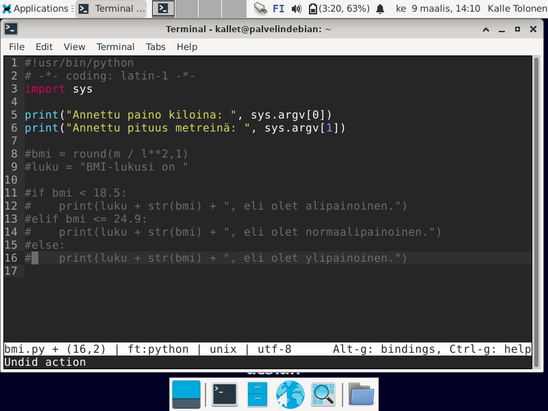
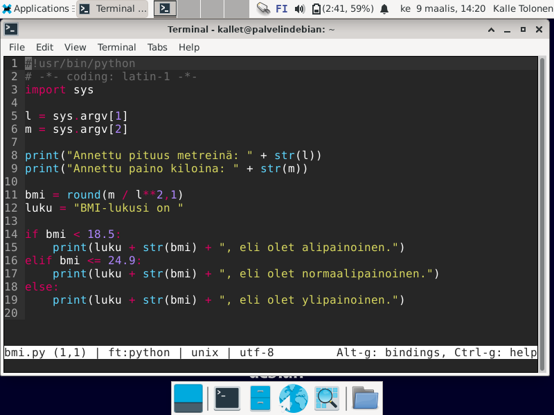
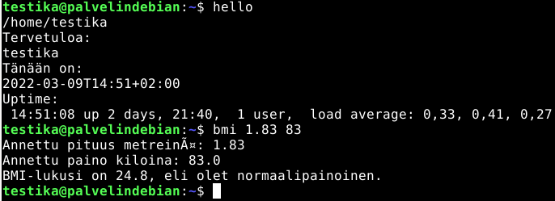

# **Harjoitus 6**

Aloitin työt 13.00.

Harjoitustyön tehtävänantona käytettiin Karvisen kotisivuilta löytyvää [h6-kohtaa](https://terokarvinen.com/2021/linux-palvelimet-ict4tn021-3018/#h6)

**Harjoituksen laitekokoonpano**  
*Järjestelmänä Win 11 + VirtualBox 6.0 + Debian 11*  
  
*Koneen perustiedot:*  
*Suoritin: AMD Ryzen 9 5900HS 8-ytiminen 3,1 - 4,5 GHz, 16 Mt välimuisti*  
*Muisti: 16 Gt LPDDR4X*  
*Näytönohjain: NVIDIA GeForce RTX 3050 Ti 4 Gt GDDR6*  
*Kiintolevy: 512 Gt M.2 2230 NVMe PCIe 3.0 SSD*  

## a) Kaikki tehtävät arvioitavaksi. Palauta linkit kaikkiin kotitehtäväraportteihisi. Arviointi tehdään ensisijaisesti tästä linkistä
[Harjoitus 1](https://github.com/kalletolonen/linux_palvelimet/blob/main/tehtava1.md)
[Harjoitus 2](https://github.com/kalletolonen/linux_palvelimet/blob/main/tehtava2.md)
[Harjoitus 3](https://github.com/kalletolonen/linux_palvelimet/blob/main/tehtava3.md)
[Harjoitus 4]()
[Harjoitus 5]()
Harjoitus 6 on tämä harjoitus.

## b) Tarkista, että olet viitannut jokaisessa tehtävässä kaikkiin lähteisiin. Esimerkiksi kurssiin, tehtävänantoihin, käyttämiisi toisten kotitehtävärapotteihin, manuaalisivuihin, kotisivuihin...  
  
Tarkistin ja päivitin raporttini - päivitettyihin kohtiin merkitsin selkeästi, että niitä on päivitetty alkuperäisen päivityksen jälkeen. Versiohistoriasta voi tarvittaessa hankkia alkuperäisen palautuksen käyttöönsä.  
    
## c) Uusi komento Linuxiin. Tee uusi komento, joka tulostaa käyttäjälle hyödyllistä tietoa. Kokeile, että komento toimii kaikista hakemistoista ja muillakin käyttäjillä kuin omallasi.  
  
	micro hello

Tein komentoaihiooni sisällön. Taikakommentti (#! /usr/bin/bash) kertoo mikä ohjelma suorittaa shell-scriptin. Muut scriptissä olevat komennot ovat linuxin vakiokomentoja. Tiedostopäätteen antaminen ei ole pakollsita, joten en sellaista antanut.  
  
  
*hello-scriptin sisältö*  
  
	bash hello
	
Kokeilin scriptin toimivuutta ajamalla sen.  
  
  
*Scripti toimi, kun sen ajoi siinä kansiossa, jossa se sijaitsi.  
  
Muokkasin tiedoston käyttäjäoikeudet sellaisiksi, että scriptin saa kuka tahansa ajaa ja tarkistin että tekemäni muutokset tulivat voimaan.  
  
	sudo chmod ugo+x hello
	ls -ld hello

  
*Muutokset olivat voimassa*  
  
Seuraavaksi siirsin hello-tiedoston oikeaan kansioon, jotta sen pystyisi suorittamaan mistä tahansa. Siirto tuli tehdä sudo-oikeuksilla, sillä bin-kansion tiedostot ovat ajettavia ohjelmia ja sinne ei ole tavallisella käyttäjällä siirto-oikeuksia.  
  
	sudo cp hello /usr/local/bin/

  
*Tarkistin scriptin toimivuuden eri kansiosta ajamalla sen sieltä käsin*  
  
Tein uuden käyttäjän, jotta pääsisin testaamaan scriptiä toisella käyttäjällä.  
  
	sudo adduser testika
	
Syötin tarvittavat tiedot ja kirjauduin kallet-käyttäjällä ulos ja testika-käyttäjällä sisään.  
  
  
*Komento toimi myös toisella käyttäjällä*  
  
## d) Parametreja. Tee skripti, joka ottaa komentoriviparametreja. Esim. 'greetuser Tero' joka tulostaa "moi" ja parametrinä olevan nimen, esim "moi Tero".  
  
Päätin tehdä komentoriviltä toimivan python-scriptin, joka laskee käyttäjän painoindeksin.  
  
Ensin räpelsin kasaan koodin, joka toimii sellaisenaan, jotta pääsin käsittelemään parametrien tuomista komentorivistä erillisenä ongelmana, kun on sellaisenaan toimiva ohjelma.  
  
*Toimiva bmi-laskuri*  
  
  
*Tuote toimi ilman komentorivisyötteitä*  
  
Etsin [lähteen](https://www.geeksforgeeks.org/command-line-arguments-in-python/) komentorivisyötteen lukemiseksi ja muokkasin ohjelmaa sen perusteella. Tein myös kopion toimivasta koodistani komennolla:  
  
	cp bmi.py bmi2.py
	
  
*Uusi ohjelman sisältö*  
  
Aloitin toimivuuden testaamisen syöttämällä kaksi parametriä ja katsomalla siitä tapahtui.  
  
  
*Tulosteesta päättelin, että syötteen argumentti [0] ei ollut oikea paikka aloittaa*  
  
  
*Seuraava yritys*  
  
  
*Totesin, että ohjelma otti parametrit vastaan komentoriviltä*  
  
Muokkasin tiedostoon loput ohjelmastani ja testasin sitä.  
  
  
*Ohjelman sisältö*  
  
Tuloksena oli tietotyypistä annettu virheilmoitus.  
  
  
*Virheilmoituksen perusteella Python oletti saavansa potenssilaskuun numerotyyppistä tietoa, mutta saikin int/str-tyyppistä*  
  
Tein siis tyyppimuunnoksen samalla, kun tallensin komentoriltä tulleet parametrit muuttujiin.  
  
  
*Muutetut kohdat ohjelmassani*  
  
  
*Ohjelma toimi testattaessa*  
  
Tein vielä huvikseni ohjelmasta sellaisen version, jota pystyi ajamaan mistä tahansa järjestelmässä ja kenen tahansa toimesta.   
  
1. Muokkasin tiedoston nimeä: *mv bmi.py bmi*  
2. Muokkasin ajo-oikeuksia: *sudo chmod ugo+x bmi*  
3. Siirsin tiedoston bin-kansioon: *sudo cp bmi /usr/local/bin/
  

  
*Kokeilu tuotti virheilmoituksen pythonin sijainnista*  
  
Selvitin ongelmaa ja lopulta ratkaisin sen, sillä minulla oli virhe bmi-tiedoston shebangissä, eli taikakommentissa.  
  
  
*Muokkasin shebangiin oikean hakemiston (/-merkki puuttui alusta)  
  
  
*Komento toimi eri hakemistoista*  
  
  
*Komento toimi myös toisella käyttäjällä*  
  
Lopetin työt 14.55.  
  
## e) Ratkaise valitsemasi vanha arvioitava laboratorioharjoitus tältä kurssilta. (Löytyy DuckDuckGolla, Googlella, linkeistä tältä sivulta tai hakemalla yläreunan hakutoiminnolla). Sovella tarvittaessa tehtäviä tähän toteutukseen sopivaksi, esimerkiksi PHP:n tilalta voi tehdä vastaavan Pythonilla; Flaskin tilalta käyttää Djangoa. Tai jättää pois jonkin epärelevantin kohdan.  
  
## f) Tee uusi tyhjä virtuaalikone (tai oikea kone) viimeisen kerran arvioitavaa labraa varten. Koneella ei saa olla luottamuksellisia tietoja. Kannattaa tehdä koneelle tarpeeksi iso virtuaalinen levy ja laittaa riittävästi RAM:ia. Guest additions saa olla asennettuna. Koneella ei saa olla muita asetuksia ennakkoon, eikä ylimääräisiä asennettuja ohjelmia.

  

  

